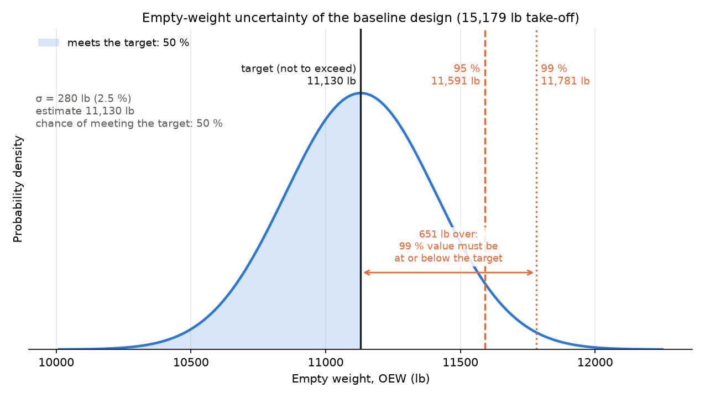
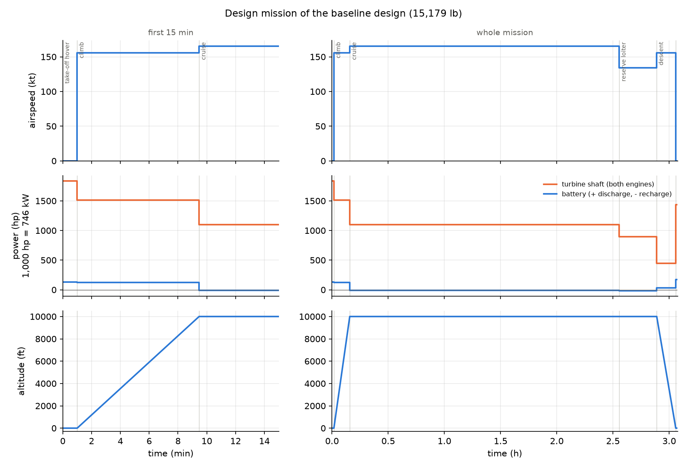
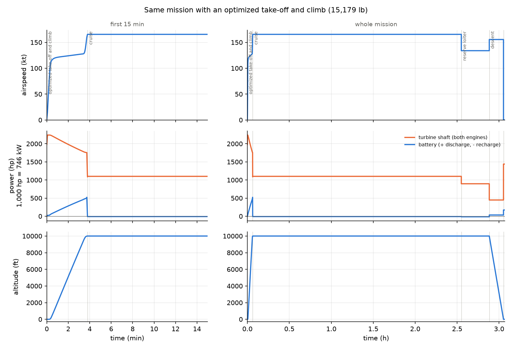
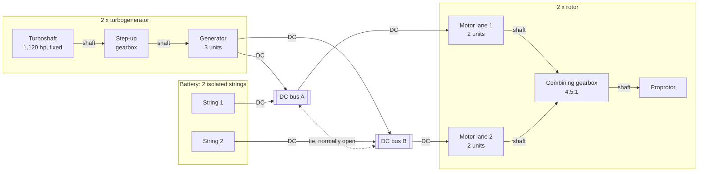

# size_halo: architecture sizing model for a Halo-class hybrid tiltrotor

The architecture team's sizing model for an unmanned, series-hybrid-electric tiltrotor. The aircraft, its powertrain
and its mission are sized together in **one gradient-based optimization** (AeroSandbox, CasADi, IPOPT). Use it to
trade configurations, set weight and power targets, and give each discipline team a consistent starting point.
Each model sits behind a simple interface, so data and higher-fidelity results from the discipline teams replace
inputs without restructuring the model.

> The inputs are illustrative engineering values from public sources ([assumptions](docs/HALO_REFERENCE.md)).
> Replacing them with program data is the first step of every work package below.

## Requirements

| | |
|---|---|
| Payload and range | 1,984 lb (900 kg) over 445 nm, plus a 20 min reserve loiter |
| Maximum speed | 210 kt sustained at 10,000 ft |
| Ceiling | 13,000 ft |
| Hover | out of ground effect at 4,000 ft (T/W 1.05), including a 95 °F day (ISA + 50 °F) at the destination |
| Failure hovers | 60 s after losing a turbogenerator, a bus or a battery string |
| Stall | at or below 120 kt in airplane mode |
| Stability | static margin and directional stability (Cn_β) margins |
| Fixed input | two off-the-shelf 1,120 hp turboshafts; the engines are bought, not designed, so they are not a design variable |

## Baseline design v3.6

| | |
|---|---|
| **Take-off weight** | **15,179 lb** (6,885 kg) |
| Empty weight (OEW) | 11,130 lb (5,049 kg), of which powertrain 6,329 lb (57 %) |
| Fuel / battery | 2,065 lb, 10 % reserve included / 70 kWh, 1,047 lb, two isolated strings |
| Mission cruise | 165 kt at 10,000 ft, L/D 9.1 (cruise speed is optimized for weight; 210 kt is a dash capability) |
| Turboshafts | 2 × 1,120 hp in the fuselage |
| Rotors | 2 × 31.7 ft diameter, disk loading 9.6 lb/ft², tip speed 782 ft/s; rotor radius capped by the span |
| Wing | 251 ft², 39.2 ft span, wing loading 60.5 lb/ft² |
| Drive | per rotor, 2 motor lanes of stacked axial-flux units behind one 4.5:1 stage; two cross-strapped DC buses |
| Fuselage | 36.1 ft long, unpressurized box section 5.5 × 6.6 ft |

The empty-weight breakdown and its uncertainty are under [Performance and weights](#performance-and-weights). The
model works in SI internally; [docs/RESULTS.md](docs/RESULTS.md) gives the SI values alongside.


**What sizes the aircraft** (the active constraints at the optimum):

- **Battery:** the engine-out hover. The pack hits its cell voltage cutoff, so voltage sag, not stored energy, sets
  its size.
- **Generators and their gearboxes:** the engine-out hover.
- **Motors:** the bus-out hover, with one lane per rotor carrying the torque.
- **Rotors and drive:** the 4,000 ft hover.
- **Heat exchanger:** the hot-day hover.
- **Tails:** static margin and directional stability.

## Aircraft versions

Every aircraft sized during development is a numbered version, and each stays reproducible from a named
requirement and assumption set:
- **Major version:** a new definition (configuration or requirements).
- **Minor version:** the same definition re-sized with better models.
- **Patch version:** a side study or a parallel line.

The table shows the main line plus the layout line that merged into the baseline. The full list, with how to
reproduce each version, is in [aircraft versions](docs/AIRCRAFT_VERSIONS.md).

**Requirements used to size each version.** Every version carries 1,984 lb (900 kg) over 445 nm, a 13,000 ft
ceiling, a 4,000 ft out-of-ground-effect hover, a 60 s engine-out hover, stall at or below 120 kt and a 20 min
reserve loiter, except where the table says otherwise.

| Version | Take-off weight | Requirements used to size it | What changed |
|---|---|---|---|
| v1.0 | 18,740 lb | 250 kt; engines sized freely | First Halo-class sizing: two-rotor series hybrid, actuator-disk rotor |
| v1.1 | 18,506 lb | as v1.0 | Supplied 1,120 hp deck part-power fuel curve |
| v1.2 | 17,228 lb | as v1.0 | Rotor-speed physics calibrated on JVX proprotor data |
| v2.0 | 14,877 lb | **210 kt; engines fixed at 2 × 1,120 hp** (250 kt is infeasible with them) | Battery-assisted hover, in-flight recharge |
| v2.1 | 13,760 lb | as v2.0 | Electric machines sized by torque; machine speed and gear ratio as design variables |
| v3.0 | 13,760 lb | as v2.0, **plus a hot-day hover at the destination** (4,000 ft, ISA + 50 °F) | Temperature lapse; the hot day is not yet binding |
| v3.0.2 | 14,436 lb | as v3.0, but **1,720 lb (780 kg) payload** | Equivalent-circuit battery; 1,984 lb (900 kg) did not close with the light-aircraft wing equations |
| v3.0.3 | 13,546 lb | as v3.0.2 | NDARC/AFDD tiltrotor wing with whirl-flutter margins |
| v3.1 | 14,247 lb | as v3.0 (payload back to 1,984 lb) | Equivalent-circuit battery and AFDD wing on the full payload |
| v3.2 | 13,639 lb | as v3.0 | AeroBuildup aerodynamics replace the simple polar and a guessed drag area |
| v3.3 | 14,037 lb | as v3.0 | Thermal model: heat exchanger, cooling drag, short-time machine ratings |
| v3.3.4 | 12,821 lb | as v3.0 | Layout line: fuselage anchored to the drawn layout, turbogenerators in the fuselage, boxy 36 ft fuselage |
| v3.3.5 | 13,038 lb | as v3.0 | Layout line: AFDD spar caps at the real box depth, 1 mm minimum gauge, nacelle inertia from components |
| v3.4 | 16,231 lb | as v3.0, **plus bus-out and string-out failure hovers** | Whole units of real machines, 2 lanes/2 buses/2 strings redundancy, gearbox stages, drag corrections |
| v3.5 | 16,303 lb | as v3.4 | Trim drag from the tail load |
| **v3.6 (baseline)** | **15,179 lb** | as v3.4 (the requirements table above) | Layout line (v3.3.4, v3.3.5) merged into v3.5, with every model on |

## Modules overview: What it does

```mermaid
flowchart LR
    REQ["<b>requirements/</b><br/>payload, range, speed,<br/>hover, failure cases"]
    subgraph MODELS["Discipline modules: each returns equations, none solves"]
        direction TB
        AERO["<b>aerodynamics/</b><br/>AeroBuildup, Scholz,<br/>download, trim drag"]
        PT["<b>powertrain/</b> + <b>core/</b><br/>rotor, motors, generators,<br/>battery, turboshaft, gearboxes<br/>joined by typed ports"]
        WT["<b>vehicle/</b> + <b>weights/</b><br/>AFDD, Raymer,<br/>mass and CG"]
        CTRL["<b>controls/</b><br/>static margin, trim"]
        TH["<b>thermal/</b><br/>heat exchanger,<br/>short-time ratings"]
    end
    PERF["<b>performance/</b> + <b>mission/</b><br/>flight points and<br/>mission segments"]
    OPTI{{"ONE asb.Opti problem<br/>IPOPT"}}
    OUT["<b>Sized aircraft</b><br/>mission and energy split,<br/>named binding constraints"]
    TRAJ["<b>trajectory/</b><br/>conversion corridor,<br/>trajectories"]
    EXP["<b>export/openvsp/</b><br/>OpenVSP, VSPAERO,<br/>CalculiX, Nastran decks"]

    REQ --> PERF
    MODELS -- "equations and residuals" --> PERF
    PERF -- "constraints: mass closure, power balance,<br/>state of charge, margins" --> OPTI
    OPTI -- "design variables: mass, wing, rotor,<br/>machines, battery, fuel, per-point operation" --> MODELS
    OPTI --> OUT
    OUT -. "checks after sizing" .-> TRAJ
    OUT -. "checks after sizing" .-> EXP
```



The loop is solved all at once, not iterated. Every module returns equations in the design variables, and IPOPT
closes mass, power, energy and every margin together, with derivatives from CasADi. The dashed modules run on
the sized aircraft afterwards, and nothing in the sizing depends on them. Each model sits behind a simple
interface, and the simpler version is kept, so the effect of each model on the answer is traceable
([how the answer moved](docs/RESULTS.md#4-how-the-answer-moved-as-fidelity-was-added)).

## Fidelity build-up: most information for the least time

Work moves up in fidelity only where the answer depends on it. Every level feeds its result back to the level
below as a calibration factor, a performance map or a weight, so the sizing loop stays fast enough to run trades
in minutes. High-fidelity tools come late, are aimed at specific parts of the design, and are never wrapped around
the whole aircraft at the start. They start only once the lower levels show exactly what is worth optimizing: which
region, which objective, and which design variables.

| Discipline | In the sizing loop now (seconds to minutes) | Next: fast checks (minutes to hours) | Later: targeted high fidelity (days) |
|---|---|---|---|
| Aerodynamics | AeroBuildup with Scholz corrections | VSPAERO vortex lattice and panel, validated against the XV-15 | ADflow RANS on airframe regions once the objective is defined: wing and wing-nacelle junction, fuselage aft body |
| Proprotor | Momentum plus profile, fitted to JVX | XROTOR blade-element theory with XFOIL polars; OpenVSP prop modeling for rotor-wing interaction | CFD with the rotor modelled (actuator disk or rotating blades) for the prop blowing over the wing: download in hover, blown wing in conversion |
| Powertrain | Component models with generic and scaled inputs | Supplier data sheets and efficiency maps | Hardware test data |
| Thermal | Heat exchanger by mass per watt | ESDU intake and duct sizing; cooling loops by temperature level | CFD of the chosen intake and exhaust installation |
| Structures | AFDD and Raymer weights with calibration factors | Nastran strength and buckling from the exported decks | Nastran flutter (SOL 145) and coupled rotor-wing whirl flutter |
| Flight dynamics | Static stability, trim corridor | Linear models at the trim points | 6-DOF simulation |

## By discipline

Each discipline lists what is in the model today, the limits to know when using the numbers, and the **work
package** that kicks off the specialist team. Approach and effort: [docs/NEXT_STEPS.md](docs/NEXT_STEPS.md).

### Performance and weights

**In the model**
- Mission analysis inside the sizing:
  - take-off hover, climb, cruise, 20 min reserve loiter, descent and landing hover;
  - fuel burn and battery state of charge through every segment;
  - the battery-versus-generator energy split, optimized per segment;
  - cruise speed optimized for weight (165 kt; 210 kt is a dash capability).
- Point performance as requirements: hover at 4,000 ft and on a hot day, ceiling, maximum speed, stall, and 60 s
  failure hovers.
- Mass closure with a full breakdown, and a cost per mission (about $3,300, with labelled price assumptions).
- **Typed ports.** Each flight point is built from components connected through typed ports (shaft, DC bus)
  with multiplicity. "Two lanes per rotor, two buses, two strings" is a topology declaration rather than
  hand-written bookkeeping. Each connection adds its speed, torque, voltage, current and power balance as named
  constraints.
- **Named binding constraints.** Every margin has a name, so the solver reports *what* sizes the aircraft: for
  example the engine-out hover battery voltage, the bus-out motor torque, or the hot-day heat rejection.

**Limits**
- Performance is computed at the design mission only; there is no payload-range diagram or endurance yet.
- The baseline carries no weight margin: it is sized to the basic estimate, without growth allowance.

**Work package: weights and performance**
- **Weights:**
  - Run weight control from the item table below.
  - Allocate a not-to-exceed weight to each item.
  - Carry each item's growth allowance and uncertainty inside the sizing, so the aircraft is sized to its 99 %
    value, not to the basic estimate.
- **Performance:**
  - Secure the installed turbine power with the engine supplier, and set the maximum take-off weight from what it
    delivers in the critical hover.
  - Size payload, battery and margin within that limit.
  - Re-solve the fixed aircraft off-design for the payload-range diagram and endurance.
  - Draw the energy flow per segment from the solved powers and losses.


**Empty-weight prediction: growth allowance, uncertainty and the chance of meeting the target.** Each item of
the empty-weight build-up carries two separate quantities:
- **Growth allowance:** the growth expected as the design matures, set by how mature the item's weight is. The
  structure follows AIAA S-120A and SAWE mass-growth practice; the percentages are program defaults for the weights
  team to set:

  | Maturity | Allowance |
  |---|---|
  | Vendor hardware | 2 % |
  | Vendor data | 5 % |
  | Calculated or layout | 8 % |
  | Calibrated parametric | 10 % |
  | Estimated | 15 % |

  The allowances add up: predicted OEW = basic OEW + Σ allowances.
- **Uncertainty (1σ):** the spread from how the item's mass is estimated. Catalogue hardware is tight; calibrated
  handbook groups carry about ±15 % at 95 %, widened where the calibration is weakest; lightly modelled items are
  wide. The items are independent, so the OEW spread is the root sum of squares.

The target is a not-to-exceed weight, and the design should carry enough margin that its 99 % value comes in at or
below it. With the target at today's basic OEW (11,130 lb):
- the growth allowance moves the prediction to 12,092 lb;
- the chance of meeting the target is effectively zero;
- the 99 % value is 1,613 lb over.

This is the size of the margin the weights team has to manage. The spread is at a fixed take-off weight:
weight growth through re-sizing, and correlated errors between items, would widen it.



| Item | Basic weight (lb) | Maturity | Growth allowance (%) | Growth allowance (lb) | Uncertainty, 1σ (%) | Uncertainty, 1σ (lb) | Predicted weight (lb) | Basis |
|---|---|---|---|---|---|---|---|---|
| Rotors | 1,488 | Calibrated parametric | 10 | 149 | 7.5 | 112 | 1,637 | AFDD blades and hubs, XV-15 calibrated |
| Battery | 1,047 | Calculated / layout | 8 | 84 | 7.5 | 79 | 1,131 | 50G cell data; 70 % cell-to-pack mass assumed |
| Motors (with inverters) | 938 | Vendor data | 5 | 47 | 5.0 | 47 | 985 | Whole catalogue units plus inverter allowance |
| Turboshafts | 930 | Vendor hardware | 2 | 19 | 2.5 | 23 | 948 | Fixed off-the-shelf engines plus installation |
| Rotor gearboxes | 645 | Calibrated parametric | 10 | 64 | 10.0 | 64 | 709 | AFDD drive system |
| Generators (with inverters) | 621 | Vendor data | 5 | 31 | 5.0 | 31 | 652 | Whole catalogue units plus inverter allowance |
| Generator gearboxes | 318 | Calibrated parametric | 10 | 32 | 10.0 | 32 | 350 | AFDD drive system |
| Heat exchanger | 280 | Estimated | 15 | 42 | 15.0 | 42 | 322 | Thermal model, mass per watt assumed |
| Protection and bus tie | 63 | Estimated | 15 | 9 | 20.0 | 13 | 72 | Simple ratings-based estimate |
| Fuselage | 1,235 | Calculated / layout | 8 | 99 | 10.0 | 123 | 1,334 | Raymer x 1.70, anchored to the drawn layout |
| Wing | 899 | Calibrated parametric | 10 | 90 | 10.0 | 90 | 989 | AFDD tiltrotor wing x 1.33 (XV-15); strength at ultimate not demonstrated |
| Systems | 898 | Calibrated parametric | 10 | 90 | 15.0 | 135 | 988 | Raymer; flight controls carry an XV-15 factor of about 4 |
| Fixed equipment | 587 | Estimated | 15 | 88 | 10.0 | 59 | 675 | Assumed allowance |
| Landing gear | 570 | Calibrated parametric | 10 | 57 | 7.5 | 43 | 627 | Raymer x XV-15 factor |
| Nacelles | 430 | Calibrated parametric | 10 | 43 | 10.0 | 43 | 472 | AFDD-class estimate |
| Tails | 183 | Calibrated parametric | 10 | 18 | 10.0 | 18 | 201 | Raymer x XV-15 factor |
| **OEW** | **11,130** | | **8.6** | **962** | **2.5** | **280** | **12,092** | Growth summed; uncertainty root sum of squares, items independent |

**Mission profiles.** Airspeed, turbine shaft power against battery power, and altitude, for the design mission
(first 15 min on the left, the whole mission on the right):

- **Design mission, as sized.** Each segment is one solved operating point, so the profile is a series of steps.
  In the take-off hover the turbines give 1,833 hp and the battery 134 hp. In cruise the turbines carry everything
  and recharge the pack.



- **Same mission with an optimized take-off and climb.** The minimum-time climb from hover to 10,000 ft at cruise
  speed, flown by direct collocation inside the computed conversion corridor, replaces the take-off hover and the
  prescribed climb.
  - The turbines run at their full 2,240 hp while the battery tops up to about 520 hp.
  - It reaches cruise in 3.8 min instead of 9.5 min, on about half the fuel (65 lb against 135 lb).
  - The aircraft is the same v3.6 design, not re-sized.



### Aerodynamics and proprotor

**In the model**
- AeroSandbox AeroBuildup in the sizing, with Scholz excrescence corrections, trim drag from the tail load, the blown
  wing and hover download. An independent Scholz hand build-up agrees within about 2 % in CD0.
- Proprotor: an analytic momentum-plus-profile-power model (neither an actuator disk nor a deck). One blade drag
  polar covers hover and airplane mode, with an airplane-mode increment and tip-Mach limits. It is fitted by least
  squares to the full-scale JVX proprotor test,
  [NASA/TM-2016-219070](https://ntrs.nasa.gov/citations/20160004035): figure of merit within 0.012, cruise
  efficiency within 0.013. The simpler actuator-disk rotor is kept as an option.
- Cross-check of the same geometry in OpenVSP VSPAERO (vortex lattice and panel) and its parasite-drag build-up.
- A V-tail effectiveness factor: the cosine of the tail dihedral scales its pitch effectiveness in the trim-drag
  model, and Scholz's V-tail interference factor applies to its drag.

**Limits**
- Drag is anchored to NASA NDARC's XV-15 estimate, not to flight data, and drag drives payload headroom more than
  anything else.
- No conversion-mode aerodynamics.
- The baseline sets the tail dihedral to 0° and sizes a conventional horizontal and vertical tail; the V-tail is
  drawn but not yet sized.
- The rotor model has no blade stall, so in cruise its power keeps falling as the rotor slows. The cruise rotor
  speed is therefore set by the model's validity bounds (advance ratio at most 0.6, blade loading), not by physics.

**Work package: aerodynamics and proprotor**, in order of information per unit time:
1. **Validate what exists.** Check VSPAERO (vortex lattice and panel) and AeroBuildup against XV-15 wind-tunnel
   and flight data, and anchor drag to the XV-15 power-required curve. Size the V-tail with its effectiveness
   factor.
2. **Proprotor by blade-element theory.**
   - Define a blade (twist, chord, airfoils) and run Mark Drella's XROTOR with XFOIL polars for hover, conversion
     and cruise, including stall.
   - Feed the result back as a rotor performance map in place of the analytic model, with JVX kept as the
     validation case.
   - Use OpenVSP's prop modeling in VSPAERO for rotor-wing interaction: download in hover and the blown wing in
     cruise.
3. **Targeted CFD, later, once it is clear exactly what to optimize** (which region, objective and design
   variables):
   - **Airframe:** the University of Michigan MDO Lab's ADflow, with pyGeo, pyHyp and IDWarp for shape changes, on
     the wing, the wing-nacelle junction or the fuselage aft body. ADflow is for wings and bodies, not rotors.
   - **Prop blowing over the wing:** CFD with the rotor modelled, as an actuator disk or with rotating blades, for
     the download in hover and the blown wing in conversion. This is where the panel-method interaction model is
     least reliable.


### Powertrain and thermal management

**In the model**
- A typed series-hybrid network, declared as components joined through ports, with multiplicity: 2 motor lanes per
  rotor, 2 cross-strapped buses, 2 battery strings.



  **Ports.** Every component declares typed ports: a shaft port carries speed and torque, a DC port voltage and
  current, a fuel port fuel flow. The network is written as a topology of connections with counts ("2 lanes per
  rotor, 2 buses, 2 strings"), not as hand-written equations. From that declaration the framework does three things:
  - it rejects wrong wiring before any solve, such as a shaft port joined to a DC port;
  - it writes the connection equations as constraints (shared speed and torque across a shaft, the power balance on
    each bus);
  - it checks speed, torque, voltage, current and power compatibility as named, normalized margins.

  A failure case reuses the same network with fewer active units (a lane, a bus or a string out), so redundancy
  is a topology choice instead of new bookkeeping.
- Components:
  - electric machines with the loss model of McDonald, "Modeling of Electric Motor Driven Propellers for Conceptual
    Aircraft Design", [AIAA 2015-1676](https://doi.org/10.2514/6.2015-1676). They are built from whole units of
    real products, taken from a cited database of 21 aerospace machines
    ([`data/machines/aerospace_motors.csv`](data/machines/aerospace_motors.csv)). The baseline uses one product per
    role: [Evolito D1500](https://evolito.aero/axial-flux-motors/)-class motors and
    [Helix SPX242](https://www.ehelix.com/products/spx242/)-class generators;
  - gearboxes with stage counts;
  - an equivalent-circuit battery (open-circuit voltage, resistance and two RC pairs) fitted to the Samsung
    INR21700-50G cell data of Paudel et al., [*Batteries* 2025, 11, 313](https://doi.org/10.3390/batteries11080313)
    ([`data/batteries/`](data/batteries/)). Scaling used in the baseline:
    - **power:** resistance divided by 5 and current rating multiplied by 5 (10C continuous), a more power-dense
      cell of the same shape;
    - **energy:** not scaled. The cell is 4.9 Ah and 69 g (about 255 Wh/kg); cells are 70 % of pack mass;
    - **end of life:** 80 % of capacity and 1.5 times the resistance;
    - **pack:** 210 cells in series (756 V nominal), two isolated strings, cells held at 77 °F (25 °C);
  - the fixed 1,120 hp turboshaft, from a GASP_TS-derived engine deck (`MAPS_1120hp.eng`, kept outside the
    repository), with density and temperature lapse and a part-power fuel curve fitted to the deck. The loader is in
    [`powertrain/decks.py`](src/aircraft_closure/powertrain/decks.py), and the fit and its checks are in
    [design log 014](docs/decisions/014-turboshaft-deck-part-power.md);
  - a heat exchanger and short-time thermal ratings.
- An electrical layer (inverter losses, DC cables, protection), built and switchable.

**Limits**
- Failures are single and symmetric; roll trim in a degraded state is not modelled.
- One catalogue product per machine role.
- The heat exchanger is sized by mass per watt; there is no battery chiller power, and losses do not depend on
  temperature.
- The electrical layer is off in the baseline.

**Work package: propulsion, electrical and thermal management**
- **Propulsion and electrical:**
  - Obtain supplier data sheets for each component:
    - motors and generators: efficiency maps, continuous and peak ratings, thermal limits, mass;
    - inverters, gearboxes and cells or packs;
    - the installed turboshaft deck.
  - Feed them into the component models in place of the generic and scaled inputs.
  - Turn on the electrical layer with the real data.
  - Use the failure framework for architecture studies: asymmetric and double failures, and an interconnect shaft
    against electrical cross-strapping.
- **Thermal management:**
  - Size the ram-air intakes, ducts and exits with ESDU methods (pressure recovery, spillage and cooling drag), in
    place of the heat exchanger's mass-per-watt assumption.
  - Lay out the cooling loops by temperature level. Separate the battery loop (coolest), the power-electronics loop
    and the motor and generator loop (warmest), so each runs at its own temperature and the heat exchangers are
    sized per loop.


### Structures

**In the model**
- Mass in the sizing is handbook-based:
  - NDARC/AFDD tiltrotor wing sized for stiffness, whirl-flutter frequency margins and the jump take-off, times
    1.33 from the XV-15 calibration;
  - AFDD rotor and drive equations;
  - Raymer fuselage times 1.70, anchored to a drawn structural layout.
- Downstream check only, never fed back: an OpenVSP structural layout exported to CalculiX and Nastran decks. A
  CalculiX wing-box check gives modal frequencies and a linear static jump take-off at ultimate load.

**Limits**
- **Wing strength at ultimate load is not yet demonstrated.** The linear finite-element check (v3.3.5) puts the peak
  spar-cap strain 10 % above the ultimate allowable, a negative margin. The check models the raw AFDD gauges,
  without the calibration material the sizing books, under an idealized root clamp.
- **No buckling analysis yet.** Plate estimates suggest the unstiffened 1 mm covers and webs need stiffening to
  reach ultimate load.
- **Whirl flutter is a frequency margin, not a stability analysis.**
- **Weights calibrate on one aircraft (the XV-15).** Flight controls carry a factor of about 4.

**Work package: stress and aeroelasticity**
- **Wing strength:**
  - Start from the Nastran decks the tool already exports.
  - Model the real fittings and stiffened covers.
  - Run strength and buckling (SOL 101 and 105), and size the panels to a margin of at least zero at ultimate load.
  - Return the result to the sizing as calibrated wing weights.
- **Flutter:**
  - Set up the flutter analysis in Nastran (SOL 145) with the nacelle and pylon mass and the rotor-pylon modes.
  - Then whirl flutter with rotor aerodynamics, to replace the frequency-placement margins the sizing uses today.


### Flight dynamics

**In the model**
- Static stability and control in the sizing: neutral point, static margin, elevator trim, Cn_β, rudder for a
  failed rotor.
- Conversion corridor: the sized aircraft trimmed at every nacelle angle (ruddervator, rotor disc tilt, attitude,
  edgewise-flow, power and placard limits).
- Point-mass trajectories by direct collocation inside that corridor: minimum-energy transition and time to climb.

**Limits**
- The corridor and trajectories run on the sized aircraft after sizing; they do not feed back into it.
- No 6-DOF and no lateral trim. No rotor in-plane force or rotor-speed schedule in the corridor.
- The trajectory model has no rotor disc tilt, so it is stricter than the trim: no level, constant-acceleration
  conversion fits the computed corridor, and the optimized conversion descends slightly through 15-90 kt.

**Work package: flight dynamics and control**
- Extend the trim and trajectory models with the rotor in-plane force, a rotor-speed schedule and rotor disc tilt.
- Linearize at the corridor trim points and start control-law design: conversion scheduling, pitch and speed hold.
- Move to a 6-DOF tiltrotor simulation for handling qualities and failure transients.


The two trajectories fly different legs. The minimum-energy transition goes from hover at 500 ft to 1.3 × stall in
airplane mode and stays near 500 ft (22 s). The minimum time to climb goes from hover at sea level to level flight
at 10,000 ft and the 165 kt cruise speed, so most of its 228 s is the climb. The corridor is computed at sea level.

## How it is checked

- **658 unit tests:** closed-form identities, limiting cases, sign conventions and trends, and every model exercised
  symbolically inside `asb.Opti`. The full suite takes 10-17 min locally and currently exceeds the 30 min CI limit
  (see [next steps](docs/NEXT_STEPS.md)).
- **Six executed discipline notebooks** ([`notebooks/`](notebooks/)) size the baseline design and verify each
  discipline with numbered checks and plots (458 checks, all passing):

| Notebook | Contents |
|---|---|
| [Global sizing](notebooks/01_global_sizing.ipynb) | The baseline design, mass closure, binding constraints, empty-weight breakdown, mission and energy allocation; requirements, missions and coupled sizing building blocks |
| [Powertrain](notebooks/02_powertrain.ipynb) | Machine units, failure cases and temperatures; machines and losses, supplier database, gearboxes, topology, margins, electrical layer, redundancy, thermal, turboshaft lapse, hot and high |
| [Energy storage](notebooks/03_energy_storage.ipynb) | The pack through the mission and the engine-out hover; the 50G equivalent-circuit cell model |
| [Aerodynamics and rotor](notebooks/04_aerodynamics_rotor.ipynb) | AeroBuildup and Scholz on the baseline design, XV-15 drag, blown wing, hover download; the JVX-calibrated proprotor; the simple model |
| [Structures and weights](notebooks/05_structures_weights.ipynb) | Airframe groups, AFDD wing items and whirl-flutter frequency margins; XV-15 weight calibration; the AFDD tiltrotor wing |
| [Dynamics and control](notebooks/06_dynamics_control.ipynb) | Static stability, the computed conversion corridor and trim, trajectories inside the corridor; trim and tail-sizing building blocks |

- **External validation:**
  - **Bell XV-15** group weights. Uncalibrated, the models give 11,315 lb against 13,000 lb actual; explicit group
    factors close it.
  - **JVX full-scale proprotor:** figure of merit within 0.012 and cruise efficiency within 0.013, with hover points
    held out of the fit.
  - **Tiltrotor wing weight:** fitted on the XV-15, then −2 % on the Bell D266 wing and −18 % on the V-22 FSD wing.
  - **Drag:** AeroBuildup and an independent Scholz hand build-up agree within about 2 % in CD0.
- **Cross-checks from another direction:** OpenVSP geometry and VSPAERO against AeroSandbox, a structural layout
  back-check of the weight equations, and a CalculiX finite-element check of the wing box.

## Running it

```bash
uv sync
uv run python -m examples.halo_sizing                    # the baseline design (about 10 min from cold)
uv run python -m examples.halo_mission_profile           # mission profile plots
uv run python -m examples.halo_oew_uncertainty           # empty-weight uncertainty
uv run python -m unittest discover -s tests              # 10-17 min
uv sync --group notebooks && uv run jupyter lab notebooks
uv run jupyter lab tutorials                            # learn the code from the bottom up
```

New to the code? The [tutorials](tutorials/README.md) teach it from first principles: AeroSandbox and `asb.Opti`, each
component, the topology, the airframe, a flight point, a mission, a coupled sizing, then the Halo driver. Most notebooks run in
seconds; each verifies what it teaches.

Set `OMP_NUM_THREADS=1` when running several solves at once; threaded BLAS under contention makes IPOPT fail
spuriously. The OpenVSP and CalculiX tools are optional and need separate installs
([details](docs/IMPLEMENTATION_NOTES.md)); nothing in the sizing depends on them.

## Repository map

| Path | Contents |
|---|---|
| `src/aircraft_closure/core` | Typed ports, topology with buses and multiplicity, connection residuals, normalized margins |
| `src/aircraft_closure/powertrain` | Motors, generators, battery, turboshaft, gearboxes, rotor; machine database; redundancy; series-hybrid builders |
| `src/aircraft_closure/vehicle`, `weights` | Airframe components, mass and CG aggregation; AFDD rotorcraft weights |
| `src/aircraft_closure/aerodynamics`, `controls` | Lift and drag build-ups, trim, download; static stability |
| `src/aircraft_closure/mission`, `requirements`, `performance` | Segments and missions; capability requirements; coupled flight points |
| `src/aircraft_closure/thermal`, `trajectory` | Heat rejection and ratings; collocation trajectories and the conversion corridor |
| `src/aircraft_closure/export/openvsp` | Optional geometry, aero cross-check and FE decks; never imported by sizing |
| `examples/` | The baseline design (`halo_sizing.py`), mission profiles, empty-weight uncertainty, XV-15 and JVX validation, conversion corridor and trajectories |
| `notebooks/` | Six executed discipline notebooks |
| `tutorials/` | A bottom-up tutorial series (22 core notebooks) and deep dives on the full reference |
| `docs/` | [Results](docs/RESULTS.md), [next steps](docs/NEXT_STEPS.md), [aircraft versions](docs/AIRCRAFT_VERSIONS.md), [architecture](docs/ARCHITECTURE.md), [coding conventions](docs/CODING_CONVENTIONS.md), [design log](docs/decisions/) |

Lower layers never import higher ones. Components build equations; callers own variables, constraints and
objectives.
