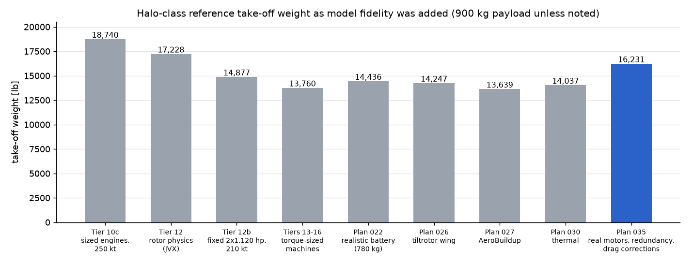
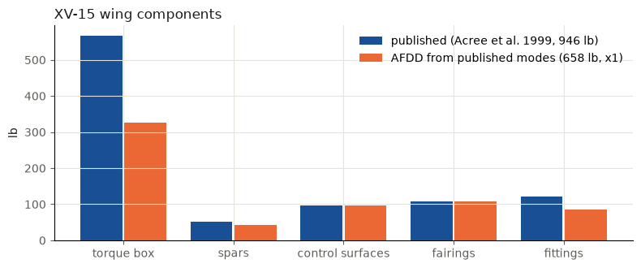
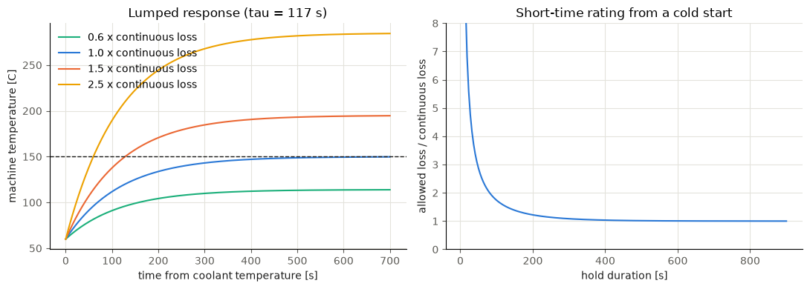
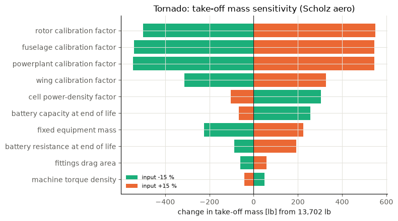

# Halo-inspired aircraft closure

[](https://github.com/rootAmos/size_halo/actions/workflows/tests.yml)

AeroSandbox/CasADi framework for sizing an unmanned series-hybrid-electric
tiltrotor together with its mission. Every discipline contributes equations to
one `asb.Opti` problem; there are no hidden convergence loops or second
solvers. The disciplines are configuration, powertrain, aerodynamics, mass,
stability, mission, energy management, thermal and redundancy. Fidelity is
added in tiers, each with a plan, tests and an executed verification notebook.
The [fidelity roadmap](docs/FIDELITY_ROADMAP.md) lists the tiers. Models are
validated against the Bell XV-15 and the full-scale JVX proprotor test.

**Current reference:** a Halo-class two-rotor series hybrid with every model on.

- **Mission:** 900 kg payload, 445 nm, 210 kt at 10,000 ft, 13,000 ft
  ceiling, hot-day hover, engine-out and electrical failure hovers.
- **Engines:** two fixed off-the-shelf 1,120 hp turboshafts, inside the fuselage.
- **Battery:** Samsung 50G-shaped equivalent-circuit pack.
- **Fuselage:** unpressurized and boxy (11 m long, 1.68 x 2.0 m). Its weight is raw Raymer GA x 1.70,
  anchored to a layout-based structure estimate.
- **Wing:** NDARC tiltrotor wing with whirl-flutter margins. Its spar caps sit at the real box depth, the
  torque box has a 1 mm minimum gauge, and the nacelle pitch inertia is built from its components.
- **Aerodynamics:** AeroSandbox AeroBuildup with Scholz drag corrections and trim drag from the tail load.
- **Thermal:** heat exchanger sized with the aircraft.
- **Machines and drive:**
  - redundant motors (2 lanes per rotor), 2 cross-strapped buses, 2 battery strings;
  - machines built from whole units of real products (2 motor units and 3 generator units);
  - a single-stage rotor gearbox.
- **Result:** 6,885 kg (15,179 lb) take-off weight.

Every earlier reference stays reproducible as a named assumption set (for example `assumptions_plan030`,
`assumptions_plan037`, `assumptions_plan038`). All numbers are illustrative engineering inputs, not Archer or
Halo data (see [reference assumptions](docs/HALO_REFERENCE.md)).

**For reviewers:**
- [docs/RESULTS.md](docs/RESULTS.md): what the framework concludes, how it is
  checked, and its limits.
- [docs/ARCHITECTURE_DIAGRAMS.md](docs/ARCHITECTURE_DIAGRAMS.md): how the
  framework is organized.

## Results at a glance

Figures from the executed tier notebooks (`notebooks/`) and the geometry
export, copied to `docs/figures/`.

**How the answer moved as fidelity was added.** Each bar is the reference
aircraft re-solved with that tier's models. The jump at plan 035 comes from
three changes: whole real machine units in place of idealized ("rubber")
scaling, electrical redundancy, and drag corrections for excrescence and
trim.



**Geometry.** The OpenVSP outer mold line at three nacelle angles, and the
structural layout used for the mass check. These are rendered from an
earlier sized design (`examples/halo_openvsp.py`, `examples/halo_structure.py`).


**Aerodynamics.**
- **Drag polar (Tier 21):** the simple model, AeroSandbox AeroBuildup and the
  Scholz hand build-up compared. The old guessed drag area was most of the
  drag.
- **Cross-check on the same geometry:** OpenVSP VSPAERO (VLM and panel)
  against AeroSandbox for lift, pitching moment, induced drag, and profile
  drag by component.


**Validation against test data.**
- **Rotor power model (Tier 12):** against full-scale JVX hover and
  airplane-mode data. The D-2 hover data were held out of the fit.
- **XV-15 wing weight (Tier 20):** the NDARC tiltrotor wing by component,
  from the published wing modes.




**Battery and thermal.**
- **Battery cell (Tier 17):** the 50G open-circuit voltage fit to the
  digitized cell data.
- **Thermal (Tier 19):** lumped machine temperature response, and the
  short-time rating it permits from a cold start.




**Trajectory optimization (Tier 14).** Minimum-energy transition and
minimum time to climb, flown inside the conversion corridor, against a
naive prescribed conversion. The minimum-energy transition uses about half
the energy of the naive schedule.


**Sensitivities (Tier 22).** Take-off mass change for ±15 % on each
uncertain input. The XV-15 weight-calibration factors dominate.



## What is in the package

| Layer | Package | Contents |
|---|---|---|
| Core | `core/` | Typed ports, topology with buses and multiplicity, connection residuals, normalized margins |
| Powertrain | `powertrain/` | Motor and generator (McDonald AIAA 2015-1676 losses), battery, turboshaft, gearbox, actuator-disk rotor; port declarations, compatibility margins, series-hybrid builders including rubber sizing |
| Vehicle | `vehicle/` | Wing, tails, fuselage, gear, systems, payload, fuel, nacelles, interconnect shaft, fixed equipment, installed powertrain; Raymer GA and AFDD masses; mass and CG aggregation |
| Aerodynamics | `aerodynamics/` | Linear lift, parasite buildup, induced drag, drag-increment hook |
| Controls | `controls/` | Neutral point, static margin, elevator trim, Cn_beta, rudder for failed-rotor yaw |
| Performance | `performance/` | Quasi-steady flight points coupling aero and the whole powertrain |
| Requirements | `requirements/` | Hover, climb, speed and ceiling capability requirements |
| Mission | `mission/` | Hover, climb, cruise, loiter, descent segments; missions with fuel burn and SOC |
| Weights | `weights/` | AFDD rotorcraft weight equations (rotor, drive system, engine section) from NDARC |
| Export | `export/openvsp/` | Numeric geometry snapshot of a solved aircraft; OpenVSP outer mold line (tilting nacelles, Modes), STEP/STL export, PyVista renders. Optional; never imported by sizing code |

Lower layers never import higher ones; components build equations and callers
own variables, constraints and objectives ([architecture](docs/ARCHITECTURE.md),
[interfaces](docs/MODEL_INTERFACES.md), [implementation notes](docs/IMPLEMENTATION_NOTES.md)).
Diagrams of the layering, fidelity scaling and sizing/trajectory/6-DOF levels are in [architecture diagrams](docs/ARCHITECTURE_DIAGRAMS.md).

## Environment and execution

With uv installed, `uv sync` creates `.venv` and installs the project from
`pyproject.toml` (Python 3.13 via `.python-version`; `uv sync --locked`
reproduces the lockfile). Examples import each other, so run them as modules
from the repository root.

```powershell
uv sync
uv run python -m unittest discover -s tests
uv run python -m examples.halo_sizing             # Tier 10c: Halo-class two-rotor series-hybrid sizing
uv run python -m examples.xv15_performance        # Tier 10b: XV-15 lapse, hover and sfc checks
uv run python -m examples.xv15_reference          # Tier 10a: XV-15 group-weight validation
uv run python -m examples.coupled_sizing          # Tier 9: sizing + mission + energy allocation
uv run python -m examples.mission_analysis        # Tier 8: prescribed and semi-free missions
uv run python -m examples.requirements_sizing     # Tier 7: powertrain sized to requirements
uv run python -m examples.tail_sizing             # Tier 6: stability-driven tail sizing
uv run python -m examples.cruise_closure          # Tier 5: cruise equilibrium in the closure
uv run python -m examples.aircraft_mass_closure   # Tier 4: mass and CG closure
uv run python -m examples.series_hybrid_point     # Tiers 2-3: topology-coupled hover point
uv run python -m examples.series_hybrid_point_explicit  # Tier 1: hand-coupled hover point
uv run python -m examples.halo_openvsp            # Plan 031: Halo in OpenVSP (needs OpenVSP, see below)
uv run python -m examples.halo_aero_compare       # Plan 031: VSPAERO and OpenVSP parasite drag vs AeroSandbox
```

### Optional: OpenVSP geometry export

The OpenVSP Python API ships with the OpenVSP release, not on PyPI. Install it
into `.venv` from a release built for Python 3.13 (3.53.1 is used here), and
the PyVista renderer from the `geometry` group:

```powershell
$vsp = "<OpenVSP-3.53.1-win64>\python"
uv pip install --system-certs "$vsp\openvsp_config" "$vsp\utilities" "$vsp\degen_geom" "$vsp\vsp_airfoils" "$vsp\openvsp"
uv sync --inexact --group geometry
```

These packages are outside the lockfile, so a plain `uv sync` removes them;
use `uv sync --inexact`. Tests that need OpenVSP skip when it is absent.
Outputs go to `output/` (not committed).

## Geometry, aero cross-check and structure tools (plan 031)

These are optional, they need OpenVSP, and nothing in the sizing depends on them. They take a solved aircraft (as
plain numbers) and check it from a different direction.

| Tool | What it does | Run |
|---|---|---|
| Outer mold line | The drawn Halo in OpenVSP: smooth bodies, a tapered wing, a V-tail, tip nacelles that tilt about the spindle, rotors. Writes `.vsp3` with hover, conversion and cruise Modes, STEP and STL per nacelle angle, and renders | `python -m examples.halo_openvsp` |
| Aero cross-check | VSPAERO (vortex lattice and panel) and the OpenVSP parasite-drag build-up against AeroSandbox VLM and AeroBuildup on the same geometry. Compares lift slope, neutral point, induced and profile drag | `python -m examples.halo_aero_compare` |
| Internal structure | Wing box (spars, ribs), fuselage (ring frames, bulkheads, floor) and V-tail as OpenVSP FEA structures. Writes CalculiX and Nastran decks, STL and a mass report, and renders the layout | `python -m examples.halo_structure` |
| Wing FE check | Runs CalculiX on the OpenVSP wing-box mesh with AFDD-mapped gauges and rigid nacelles: free-free beam, chord and torsion frequencies vs AFDD, and the ultimate jump take-off strain | `python -m examples.halo_wing_fe` (needs CalculiX, `CCX`) |
| Weight back-check | Sizes the primary-structure gauges on the drawn layout from simple ultimate loads and the AFDD stiffness requirements, then compares with the AFDD wing and Raymer tail and fuselage | `python -m examples.halo_structure_reference`, then `python -m examples.halo_structure_check` |

Main findings so far:
- The AFDD wing agrees with the layout to within about 10 %.
- AeroBuildup is conservative on stability and induced drag compared with VSPAERO.
- The XV-15 fuselage calibration overstated an uncrewed fuselage, which led to plan 037.
- The CalculiX wing check found the AFDD wing optimistic for this layout, because the caps work over a shorter
  lever arm in the real box. The jump take-off strain was 1.29x the allowable. Plan 038 corrects the model: the
  FE re-check gives 1.10x, and beam frequency rises from 0.70x to 0.85x of the AFDD estimate.

Limits:
- Fuselage FE meshing takes minutes per file type.
- The structural STEP export is off.
- Only the wing box has been solved by FE; the fuselage and tail decks carry placeholder gauges.

See [implementation notes](docs/IMPLEMENTATION_NOTES.md) (plans 031, 037 and 038) for numbers and OpenVSP quirks.

## Continuous integration

GitHub Actions runs the unit suite on every push and pull request
(`.github/workflows/tests.yml`: `uv sync --locked`, then `unittest`). The
notebooks workflow (`notebooks.yml`) executes every verification notebook on
demand and uploads the executed copies as an artifact. Tests that need
user-supplied local data in `data/` skip when it is absent.

## Verification notebooks

One executed notebook per tier (outputs kept so plots render on GitHub):

| Tier | Notebook |
|---|---|
| 0 | [Foundation](notebooks/tier0_foundation/foundation_verification.ipynb): environment, layout, governance, skills, conventions |
| 1 | [Powertrain components](notebooks/tier1_powertrain_components/powertrain_verification.ipynb) and [McDonald machine losses](notebooks/tier1_powertrain_components/motor_loss_model_verification.ipynb) |
| 2 | [Powertrain topology](notebooks/tier2_powertrain_topology/topology_verification.ipynb): ports, wiring rules, residuals, multiplicity |
| 3 | [Compatibility margins](notebooks/tier3_compatibility_margins/compatibility_verification.ipynb): envelopes, operating and design margins |
| 4 | [Vehicle mass closure](notebooks/tier4_vehicle_mass_closure/mass_closure_verification.ipynb): geometry, Raymer masses, CG, payload growth |
| 5 | [Aerodynamics](notebooks/tier5_aerodynamics/aerodynamics_verification.ipynb): lift, parasite buildup, polar, AeroBuildup comparison |
| 6 | [Stability and control](notebooks/tier6_stability_control/stability_control_verification.ipynb): neutral point, trim, Cn_beta, tail sizing |
| 7 | [Requirements](notebooks/tier7_requirements/requirements_verification.ipynb): flight points, requirement feasibility, powertrain sizing |
| 8 | [Missions](notebooks/tier8_missions/mission_verification.ipynb): segments, prescribed and semi-free missions |
| 9 | [Coupled sizing](notebooks/tier9_coupled_sizing/coupled_sizing_verification.ipynb): simultaneous sizing, mission optimization and energy allocation |
| 10a | [XV-15 mass validation](notebooks/tier10_xv15_reference/xv15_mass_validation.ipynb): AFDD weights, group-by-group comparison, calibration |
| 10b | [XV-15 power validation](notebooks/tier10_xv15_reference/xv15_power_validation.ipynb): engine lapse, hover figure of merit and download, part-power sfc |
| 10c | [Halo-class sizing](notebooks/tier10_halo_sizing/halo_sizing_verification.ipynb): two-rotor series hybrid, binding constraints, mission, sensitivities |

```powershell
uv sync --group notebooks
uv run jupyter lab notebooks
```

## Status and next step

All roadmap tiers 0-22 are implemented, and Tier 23 (geometry) is partial. Open items, roughly by impact (see
[docs/RESULTS.md](docs/RESULTS.md)):

- **Drag calibration** against XV-15 flight data, and airplane-mode rotor efficiency.
- **Weight calibration** rests on one complete aircraft.
- **Wing:** the corrected wing is still 10 % over the strain allowable in the jump take-off by FE, and wing
  torsion is not yet cleanly identified in the FE modes.
- **Layout assumptions:** the turbogenerator station and the nacelle drive and cowling offsets.
- **V-tail:** the sizing uses a conventional tail; the V-tail is drawn only.
- **Geometry:** the symbolic layout with clearance and packaging constraints (Tier 23) is still planned.
- **Trajectories:** the trajectory layer has no 6-DOF yet.
