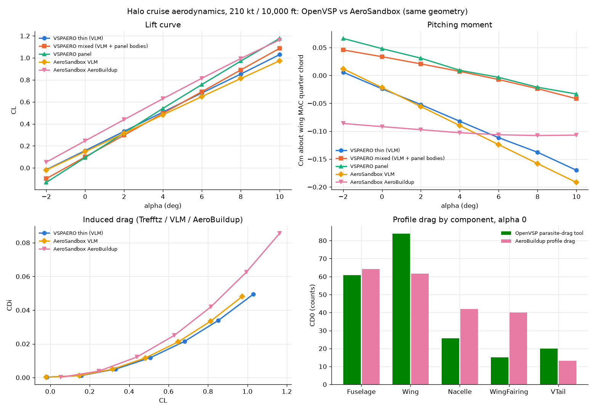

# size_halo: sizing a Halo-class hybrid tiltrotor from scratch

How I would size an unmanned, series-hybrid-electric tiltrotor starting from a clean sheet. The aircraft, its
powertrain and its mission are sized together in **one gradient-based optimization** (AeroSandbox, CasADi, IPOPT),
and every model is checked against public tiltrotor data before it is trusted.

> All numbers are illustrative engineering inputs drawn from public sources. Nothing here is Archer or Halo data.
> See [assumptions](docs/HALO_REFERENCE.md).

## Requirements

| | |
|---|---|
| Payload and range | 1,984 lb (900 kg) over 445 nm, plus a 20 min reserve loiter |
| Maximum speed | 210 kt sustained at 10,000 ft |
| Ceiling | 13,000 ft |
| Hover | out of ground effect at 4,000 ft (T/W 1.05), including a 95 °F day (ISA + 50 °F) at the destination |
| Failure hovers | 60 s after losing a turbogenerator, a bus or a battery string |
| Stall | at or below 120 kt in airplane mode |
| Stability | static margin and directional stability (Cn_β) margins |
| Fixed input | two off-the-shelf 1,120 hp turboshafts. A non-OEM cannot add turbine power, so the engines are not a design variable |

## The sized aircraft: baseline design v3.6

| | |
|---|---|
| **Take-off weight** | **15,179 lb** (6,885 kg) |
| Empty weight (OEW) | 11,130 lb (5,049 kg), of which powertrain 6,329 lb (57 %) |
| Fuel / battery | 2,065 lb, 10 % reserve included / 70 kWh, 1,047 lb, two isolated strings |
| Mission cruise | 165 kt at 10,000 ft, L/D 9.1 (cruise speed is optimized for weight; 210 kt is a dash capability) |
| Turboshafts | 2 × 1,120 hp in the fuselage |
| Rotors | 2 × 31.7 ft diameter, disk loading 9.6 lb/ft², tip speed 782 ft/s; rotor radius capped by the span |
| Wing | 251 ft², 39.2 ft span, wing loading 60.5 lb/ft² |
| Drive | per rotor, 2 motor lanes of stacked axial-flux units behind one 4.5:1 stage; two cross-strapped DC buses |
| Fuselage | 36.1 ft long, unpressurized box section 5.5 × 6.6 ft |

**Empty weight breakdown (lb):**

| Powertrain | | Airframe and systems | |
|---|---|---|---|
| Rotors and gearboxes | 2,450 | Wing, nacelles, tails | 1,511 |
| Motors and generators (with inverters) | 1,559 | Systems and equipment | 1,485 |
| Battery | 1,047 | Fuselage | 1,235 |
| Turboshafts | 930 | Landing gear | 570 |
| Heat exchanger, protection, bus tie | 343 | | |
| **Total powertrain** | **6,329** | **Total airframe and systems** | **4,801** |

The model works in SI internally; [docs/RESULTS.md](docs/RESULTS.md) gives the SI values alongside.


**What sizes the aircraft** (the active constraints at the optimum):

- **Battery:** the engine-out hover. The pack hits its cell voltage cutoff, so voltage sag, not stored energy, sets
  its size.
- **Generators and their gearboxes:** the engine-out hover.
- **Motors:** the bus-out hover, with one lane per rotor carrying the torque.
- **Rotors and drive:** the 4,000 ft hover.
- **Heat exchanger:** the hot-day hover.
- **Tails:** static margin and directional stability.

**Findings worth knowing:**

- With these engines, payload goes to zero near 228 kt, so 250 kt is out of reach at any size.
- A realistic (equivalent-circuit) battery costs about 510 lb (230 kg) of payload against an ideal one.
- Real catalogue machines change the architecture, not just the mass. A freely scalable motor wants about
  13,000 rpm behind a 32:1 gearbox; whole units of real products want slow, stacked axial-flux motors behind a
  single stage.
- In conversion, the optimized transition rides the low-speed side of the computed corridor; no level,
  constant-acceleration conversion fits inside it.

## Aircraft versions

Every aircraft sized during development is a numbered version and stays reproducible from a named
requirement and assumption set. A major version means a new definition (configuration or requirements), and a minor
version means the same definition re-sized with better models. Patch versions are side studies or a parallel line.
The table below shows the main line plus the layout line that merged into the baseline; the full list, with how to
reproduce each version, is in [aircraft versions](docs/AIRCRAFT_VERSIONS.md).

**Requirements used to size each version.** Every version carries 1,984 lb (900 kg) over 445 nm, a 13,000 ft
ceiling, a 4,000 ft out-of-ground-effect hover, a 60 s engine-out hover, stall at or below 120 kt and a 20 min
reserve loiter, except where the table says otherwise.

| Version | Take-off weight | Requirements used to size it | What changed |
|---|---|---|---|
| v1.0 | 18,740 lb | 250 kt; engines sized freely | First Halo-class sizing: two-rotor series hybrid, actuator-disk rotor |
| v1.1 | 18,506 lb | as v1.0 | Supplied 1,120 hp deck part-power fuel curve |
| v1.2 | 17,228 lb | as v1.0 | Rotor-speed physics calibrated on JVX proprotor data |
| v2.0 | 14,877 lb | **210 kt; engines fixed at 2 × 1,120 hp** (250 kt is infeasible with them) | Battery-assisted hover, in-flight recharge |
| v2.1 | 13,760 lb | as v2.0 | Electric machines sized by torque; machine speed and gear ratio as design variables |
| v3.0 | 13,760 lb | as v2.0, **plus a hot-day hover at the destination** (4,000 ft, ISA + 50 °F) | Temperature lapse; the hot day is not yet binding |
| v3.0.2 | 14,436 lb | as v3.0, but **1,720 lb (780 kg) payload** | Equivalent-circuit battery; 900 kg did not close with light-aircraft wing equations |
| v3.0.3 | 13,546 lb | as v3.0.2 | NDARC/AFDD tiltrotor wing with whirl-flutter margins |
| v3.1 | 14,247 lb | as v3.0 (payload back to 1,984 lb) | Equivalent-circuit battery and AFDD wing on the full payload |
| v3.2 | 13,639 lb | as v3.0 | AeroBuildup aerodynamics replace the simple polar and a guessed drag area |
| v3.3 | 14,037 lb | as v3.0 | Thermal model: heat exchanger, cooling drag, short-time machine ratings |
| v3.3.4 | 12,821 lb | as v3.0 | Layout line: fuselage anchored to the drawn layout, turbogenerators in the fuselage, boxy 36 ft fuselage |
| v3.3.5 | 13,038 lb | as v3.0 | Layout line: AFDD spar caps at the real box depth, 1 mm minimum gauge, nacelle inertia from components |
| v3.4 | 16,231 lb | as v3.0, **plus bus-out and string-out failure hovers** | Whole units of real machines, 2 lanes/2 buses/2 strings redundancy, gearbox stages, drag corrections |
| v3.5 | 16,303 lb | as v3.4 | Trim drag from the tail load |
| **v3.6 (baseline)** | **15,179 lb** | as v3.4 (the requirements table above) | Layout line (v3.3.4, v3.3.5) merged into v3.5, with every model on |

## What it does

```
requirements ──┐
mission ───────┤      components return equations and residuals,
powertrain ────┤      never variables or loops
aero / rotor ──┼──►  ONE asb.Opti problem  ──►  IPOPT  ──►  sized aircraft + mission + energy split
weights ───────┤      caller owns every variable, constraint
stability ─────┤      and the objective
thermal ───────┤
failure cases ─┘
```

- **One problem, no hidden loops.** Mass closure, mission fuel and state of charge, battery-versus-generator energy
  allocation and every failure case are constraints in the same problem. Derivatives come from CasADi automatic
  differentiation.
- **Typed powertrain network.** Components connect through ports (shaft, DC bus) with multiplicity, so "two lanes
  per rotor, two buses, two strings" is a topology, not hand-written bookkeeping. Speed, torque, voltage, current
  and power compatibility are checked as normalized margins.
- **Named binding constraints.** Every margin has a name, so the solver reports *what* sizes the aircraft.
- **Fidelity in layers.** Each model sits behind a simple interface, and the simple version is kept, so the effect
  of each model on the answer is traceable
  ([how the answer moved](docs/RESULTS.md#4-how-the-answer-moved-as-fidelity-was-added)).
- **Conversion and trajectories.** The sized aircraft is trimmed at every nacelle angle to compute its conversion
  corridor, then flown by direct collocation (minimum-energy transition, time to climb) inside it.
- **Geometry and structure exports.** The sized aircraft goes to OpenVSP (outer mold line, internal structure,
  STEP/STL), VSPAERO and CalculiX as independent checks; nothing in the sizing depends on them.

## Status by discipline

For each model type: what the tool can do, what the sizing uses, what is wrong or unproven today, and what comes
next. Approach and effort for the next steps are in [docs/NEXT_STEPS.md](docs/NEXT_STEPS.md).

### Structures and weights

- **Can do:** handbook mass for every group. Also a drawn structural layout in OpenVSP (spars, ribs, frames),
  exported to CalculiX and Nastran. A CalculiX check of the wing box gives its modal frequencies and a linear static
  jump take-off at ultimate load.
- **Used in sizing:** handbook and parametric mass only. These are:
  - the NDARC/AFDD tiltrotor wing, sized for stiffness, whirl-flutter frequency margins and the jump take-off,
    times 1.33 from the XV-15 calibration;
  - AFDD rotor, drive and engine-section equations;
  - Raymer GA for the fuselage times 1.70, anchored once by hand to the drawn layout;
  - Raymer for the tails.

  Finite-element results never feed the sizing.
- **Wrong or unproven:**
  - **Wing strength at ultimate load is not demonstrated.** On v3.3.5 (13,038 lb) the linear finite-element check
    puts the peak front spar-cap strain in the jump take-off **10 % above the ultimate allowable, a negative
    margin**. The check models the raw AFDD gauges, without the 1.33 calibration material the sizing books, under
    an idealized full clamp at the root. It has not been re-run on the baseline.
  - **Buckling is not analysed at all.** Plate estimates suggest the unstiffened 1 mm covers and webs would buckle
    well below ultimate.
  - Wing torsion is not cleanly separated from nacelle modes.
  - Whirl flutter is a frequency margin (the NDARC practice), not a coupled rotor-wing stability constraint.
  - Weight calibration rests on one complete aircraft. Flight controls carry a factor of about 4, and the calibration
    factors are the largest sensitivities (about ±540 lb each for ±15 %).
- **Next:**
  - close the wing: support the finite-element root on fittings, model the calibrated structure, add a CalculiX
    buckling step, size stiffened covers and webs, and enforce a cap-strain margin of at least zero in the sizing;
  - whirl flutter as a coupled rotor-pylon-wing stability model in CasADi, inside the optimization;
  - a second weight anchor, ideally an uncrewed fly-by-wire aircraft.


### Powertrain and energy storage

- **Can do:** a typed series-hybrid network (shafts, DC buses, multiplicity) with:
  - McDonald-loss machines built from whole units of real products, with a supplier database;
  - gearboxes with stage counts;
  - a Samsung 50G-shaped equivalent-circuit battery with sag and end-of-life rating;
  - a fixed turboshaft deck with lapse and a part-power fuel curve;
  - a momentum-plus-profile rotor fitted to full-scale JVX data;
  - thermal ratings and a heat exchanger;
  - lane-out, bus-out and string-out failure hovers;
  - an electrical layer (inverters, cables, protection).
- **Used in sizing:** all of it except the electrical layer. The battery is sized by its cell voltage cutoff in the
  engine-out hover, the generators by the engine-out hover, and the motors by the bus-out hover.
- **Wrong or unproven:**
  - Airplane-mode rotor efficiency is fitted to the JVX test, not checked against flight data.
  - The electrical layer is built but off by default. It adds about 730 lb (330 kg) and 3 % losses, and with every
    option on the problem converges only through the multistart strategy.
  - Failures are single and symmetric. Double failures did not converge (not shown infeasible), and degraded states
    apply to both rotors.
  - One catalogue product per machine role.
  - Battery chiller power is not modelled.
- **Next:** the electrical layer on by default, with problem scaling and continuation; asymmetric and double
  failures, including an interconnect shaft against electrical cross-strapping; cruise rotor efficiency against
  flight data.


### Aerodynamics

- **Can do:**
  - AeroSandbox AeroBuildup, a Scholz hand build-up and a simple linear model;
  - compressibility, the blown wing and hover download;
  - trim drag from the tail load;
  - an OpenVSP VSPAERO and parasite-drag cross-check on the same geometry.
- **Used in sizing:** AeroBuildup with Scholz excrescence corrections, trim drag from the tail load, and hover
  download. AeroBuildup and Scholz agree within about 2 % in CD0.
- **Wrong or unproven:**
  - Drag is not anchored to flight data. The excrescence factor matches NASA NDARC's XV-15 estimate, and drag drives
    payload headroom more than anything else.
  - The sizing uses a conventional tail; the V-tail is only drawn.
  - There is no conversion-mode aerodynamics.
- **Next:** anchor drag to the XV-15 power-required curve; V-tail in the sizing.




### Trajectory, stability and control

- **Can do:**
  - static stability: neutral point, static margin, elevator trim, Cn_β, rudder for a failed rotor;
  - a conversion corridor computed by trimming the sized aircraft at every nacelle angle (ruddervator, rotor disc
    tilt, attitude, edgewise-flow, power and placard limits);
  - point-mass direct-collocation trajectories inside that corridor (minimum-energy transition, time to climb).
- **Used in sizing:** static stability and hover trim only. The sizing flies quasi-steady mission segments and
  requirement points. The corridor and the trajectories are separate solves on the sized aircraft, so the coupling
  is one-way.
- **Wrong or unproven:**
  - The trajectories are point-mass, with no rotor disc tilt and no 6-DOF.
  - The corridor has no rotor in-plane force or rotor-speed schedule.
  - There is no lateral trim.
- **Next:** rotor in-plane force, a rotor-speed schedule and rotor disc tilt in the trajectory model, then linearized
  models at the corridor trim points as the first control-law step.


### Across disciplines

Propagate the calibration factors to a take-off-weight band instead of a single number. Not computed yet: the
payload-range curve and maximum endurance.

## How it is checked

- **658 unit tests:** closed-form identities, limiting cases, sign conventions and trends, and every model exercised
  symbolically inside `asb.Opti`. The full suite takes 10-17 min locally and currently exceeds the 30 min CI limit
  (see [next steps](docs/NEXT_STEPS.md)).
- **Six executed discipline notebooks** ([`notebooks/`](notebooks/)) size the baseline design and verify each
  discipline with numbered checks and plots (458 checks, all passing):

| Notebook | Contents |
|---|---|
| [Global sizing](notebooks/01_global_sizing.ipynb) | The baseline design, mass closure, binding constraints, empty-weight breakdown, mission and energy allocation; requirements, missions and coupled sizing building blocks |
| [Powertrain](notebooks/02_powertrain.ipynb) | Machine units, failure cases and temperatures; machines and losses, supplier database, gearboxes, topology, margins, electrical layer, redundancy, thermal, turboshaft lapse, hot and high |
| [Energy storage](notebooks/03_energy_storage.ipynb) | The pack through the mission and the engine-out hover; the 50G equivalent-circuit cell model |
| [Aerodynamics and rotor](notebooks/04_aerodynamics_rotor.ipynb) | AeroBuildup and Scholz on the baseline design, XV-15 drag, blown wing, hover download; the JVX-calibrated proprotor; the simple model |
| [Structures and weights](notebooks/05_structures_weights.ipynb) | Airframe groups, AFDD wing items and whirl-flutter frequency margins; XV-15 weight calibration; the AFDD tiltrotor wing |
| [Dynamics and control](notebooks/06_dynamics_control.ipynb) | Static stability, the computed conversion corridor and trim, trajectories inside the corridor; trim and tail-sizing building blocks |

- **External validation:**
  - **Bell XV-15** group weights. Uncalibrated, the models give 11,315 lb against 13,000 lb actual; explicit group
    factors close it.
  - **JVX full-scale proprotor:** figure of merit within 0.012 and cruise efficiency within 0.013, with hover points
    held out of the fit.
  - **Tiltrotor wing weight:** fitted on the XV-15, then −2 % on the Bell D266 wing and −18 % on the V-22 FSD wing.
  - **Drag:** AeroBuildup and an independent Scholz hand build-up agree within about 2 % in CD0.
- **Cross-checks from another direction:** OpenVSP geometry and VSPAERO against AeroSandbox, a structural layout
  back-check of the weight equations, and a CalculiX finite-element check of the wing box.


## Running it

```bash
uv sync
uv run python -m examples.halo_sizing                    # the baseline design (about 10 min from cold)
uv run python -m unittest discover -s tests              # 10-17 min
uv sync --group notebooks && uv run jupyter lab notebooks
```

Set `OMP_NUM_THREADS=1` when running several solves at once; threaded BLAS under contention makes IPOPT fail
spuriously. The OpenVSP and CalculiX tools are optional and need separate installs
([details](docs/IMPLEMENTATION_NOTES.md)); nothing in the sizing depends on them.

## Repository map

| Path | Contents |
|---|---|
| `src/aircraft_closure/core` | Typed ports, topology with buses and multiplicity, connection residuals, normalized margins |
| `src/aircraft_closure/powertrain` | Motors, generators, battery, turboshaft, gearboxes, rotor; machine database; redundancy; series-hybrid builders |
| `src/aircraft_closure/vehicle`, `weights` | Airframe components, mass and CG aggregation; AFDD rotorcraft weights |
| `src/aircraft_closure/aerodynamics`, `controls` | Lift and drag build-ups, trim, download; static stability |
| `src/aircraft_closure/mission`, `requirements`, `performance` | Segments and missions; capability requirements; coupled flight points |
| `src/aircraft_closure/thermal`, `trajectory` | Heat rejection and ratings; collocation trajectories and the conversion corridor |
| `src/aircraft_closure/export/openvsp` | Optional geometry, aero cross-check and FE decks; never imported by sizing |
| `examples/` | The baseline design (`halo_sizing.py`), XV-15 and JVX validation, conversion corridor and trajectories |
| `notebooks/` | Six executed discipline notebooks |
| `docs/` | [Results](docs/RESULTS.md), [next steps](docs/NEXT_STEPS.md), [aircraft versions](docs/AIRCRAFT_VERSIONS.md), [architecture](docs/ARCHITECTURE.md), [coding conventions](docs/CODING_CONVENTIONS.md), [design log](docs/decisions/) |

Lower layers never import higher ones. Components build equations; callers own variables, constraints and
objectives.
