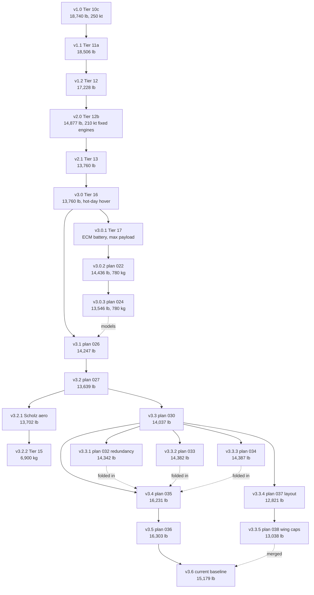

# Aircraft versions

The Halo-class aircraft was re-sized many times as models were added. Each sized aircraft gets a version number
so that every result quoted during development can be traced to a definition and reproduced from a named
requirement/assumption set in `examples/halo_sizing.py`.

The scheme is `vX.Y`, with `vX.Y.Z` for a derivative:

- **Major X:** a new aircraft definition, i.e. a change of configuration or requirements (for example sized
  engines at 250 kt replaced by fixed 2 x 1,120 hp engines at 210 kt, or a new hover requirement).
- **Minor Y:** the same definition re-sized after a model change (rotor physics, battery, wing weights,
  aerodynamics, thermal, real machine units and redundancy, drag corrections, trim drag).
- **Patch Z:** a variant of a version that was studied but not carried forward, or a branch that ran in
  parallel and merged later (the geometry and layout line).

Tiers 1-9 (`docs/decisions/001` to `012`) sized small generic example aircraft and the XV-15 validation case,
not the Halo. They are pre-Halo framework examples and are not versioned.

## Version table

Take-off weights are the values in the design log, `docs/RESULTS.md` section 4 and the pinned integration
tests. Where the source gives only lb, the kg value is converted (1 lb = 0.45359237 kg) and rounded.

| Version | Take-off weight | Payload | Max speed | What changed from the parent | Parent | How to reproduce | Design log entry |
|---|---|---|---|---|---|---|---|
| v1.0 | 8,500 kg (18,740 lb) | 900 kg | 250 kt | First Halo-class sizing (Tier 10c): two-rotor series hybrid, engines sized freely, actuator-disk rotor, Geiss part-power fuel curve | none | No pinned set. `solve_halo_sizing(requirements_tier10c, replace(assumptions_tier11a, part_power_model=GeissPartPowerModel()))` restores the Tier 10c fuel curve (not test-pinned) | `docs/decisions/013-halo-class-sizing.md` |
| v1.1 | 8,394 kg (18,506 lb) | 900 kg | 250 kt | Supplied 1,120 hp GASP deck part-power fuel curve replaces Geiss (Tier 11a) | v1.0 | `solve_halo_sizing(requirements_tier10c, assumptions_tier11a)` | `docs/decisions/014-turboshaft-deck-part-power.md` |
| v1.2 | 7,814 kg (17,228 lb) | 900 kg | 250 kt | Rotor-speed physics calibrated on JVX proprotor data (Tier 12) | v1.1 | `solve_halo_sizing(requirements_tier10c, assumptions_tier12)` | `docs/decisions/016-rotor-speed-physics.md` |
| v2.0 | 6,747 kg (14,875 lb; 14,877 lb pinned) | 900 kg | 210 kt | New definition: engines fixed at 2 x 1,120 hp off-the-shelf turboshafts, battery-assisted hover, in-flight recharge; 250 kt is infeasible with them (Tier 12b) | v1.2 | `solve_halo_sizing(requirements_tier12b, assumptions_tier12b)` | `docs/decisions/017-fixed-engines-battery-assist.md` |
| v2.1 | 6,241 kg (13,760 lb) | 900 kg | 210 kt | Electric machines sized by torque; machine speed and gear ratio as design variables; step-up generators (Tier 13) | v2.0 | `solve_halo_sizing(requirements_tier12b, assumptions_tier16)` (within 0.1 % of v3.0, test-checked) | `docs/decisions/018-torque-sized-machines.md` |
| v3.0 | 6,241 kg (13,760 lb) | 900 kg | 210 kt | New definition: hot-day hover at the destination added (4,000 ft, ISA + 27.7 K), with the temperature lapse (Tier 16). Not binding at the reference | v2.1 | `solve_halo_sizing(requirements_tier16, assumptions_tier16)` | `docs/decisions/020-hot-and-high.md` |
| v3.0.1 | not recorded | below 900 kg (max-payload solve) | 210 kt | Equivalent-circuit battery with sag and ageing (Tier 17); the 900 kg aircraft does not close with the light-aircraft wing equations | v3.0 | `solve_halo_sizing(assumptions=assumptions_tier17, objective="payload", initial=<v3.0 result>)` | `docs/decisions/021-battery-ecm.md` |
| v3.0.2 | 6,548 kg (14,436 lb) | 780 kg | 210 kt | Equivalent-circuit battery as the reference, payload lowered to 780 kg to close (plan 022) | v3.0.1 | `solve_halo_sizing(requirements_plan022, assumptions_plan022)` | `docs/decisions/022-ecm-reference.md` |
| v3.0.3 | 6,144 kg (13,546 lb) | 780 kg | 210 kt | AFDD (NDARC) tiltrotor wing weights and whirl-flutter margins replace Raymer (Tier 20, plan 024) | v3.0.2 | `solve_halo_sizing(requirements_plan022, assumptions_tier20)` | `docs/decisions/024-tiltrotor-wing-weights.md` |
| v3.1 | 6,462 kg (14,247 lb) | 900 kg | 210 kt | Equivalent-circuit battery and AFDD wing on the 900 kg definition; payload back to 900 kg (plan 026) | v3.0 (models from v3.0.3) | `solve_halo_sizing(requirements_plan026, assumptions_plan026)` | `docs/decisions/026-afdd-wing-reference.md` |
| v3.2 | 6,187 kg (13,639 lb) | 900 kg | 210 kt | AeroBuildup aerodynamics replace the simple polar and the guessed 0.8 m2 miscellaneous drag area (Tier 21, plan 027) | v3.1 | `solve_halo_sizing(requirements_plan027, assumptions_plan027)` | `docs/decisions/027-aerobuildup-reference.md` (study: `docs/decisions/025-aerodynamics-buildup.md`) |
| v3.2.1 | 6,215 kg (13,702 lb) | 900 kg | 210 kt | Scholz level-0 aerodynamics instead of AeroBuildup (fast hand-check set) | v3.2 | `solve_halo_sizing(assumptions=replace(assumptions_plan027, aerodynamics_model="scholz"))` | `docs/decisions/025-aerodynamics-buildup.md` |
| v3.2.2 | 6,900 kg | 900 kg | 210 kt | Electrical layer on: inverters, cables, protection, 756 V pack-set bus (Tier 15). No converged AeroBuildup start was found, so the result is on Scholz aerodynamics | v3.2.1 | `solve_halo_sizing(assumptions=replace(assumptions_tier15, aerodynamics_model="scholz"))` | `docs/decisions/023-electrical-layer.md` |
| v3.3 | 6,367 kg (14,037 lb) | 900 kg | 210 kt | Thermal model: heat loads, heat exchanger (+133 kg), cooling drag, short-time machine ratings (Tier 19, plan 030) | v3.2 | `solve_halo_sizing(requirements_plan030, assumptions_plan030)` | `docs/decisions/030-thermal-reference.md` (study: `docs/decisions/028-thermal.md`) |
| v3.3.1 | 6,505 kg (14,342 lb) | 900 kg | 210 kt | Redundancy: 2 lanes per rotor, 2 cross-strapped buses, 2 battery strings; bus-out and string-out hovers (Tier 18, plan 032) | v3.3 | `solve_halo_sizing(requirements_plan030, assumptions_tier18)` | `docs/decisions/032-redundancy.md` |
| v3.3.2 | 6,524 kg (14,382 lb) | 900 kg | 210 kt | Electric machines from a supplier database and gearbox stage count (relaxed stages) | v3.3 | No named set: `machine_mass_model="database"` and `gearbox_stages=True` on `assumptions_plan030` (not test-pinned) | `docs/decisions/033-machine-database-gear-stages.md` |
| v3.3.3 | 6,526 kg (14,387 lb) | 900 kg | 210 kt | Excrescence and flat 2 % trim drag corrections | v3.3 | No named set: `drag_corrections=True` on `assumptions_plan030`. The current code applies the plan 036 tail-load trim instead of the flat 2 %, so this does not reproduce exactly | `docs/decisions/034-drag-corrections.md` |
| v3.3.4 | 5,815.5 kg (12,821 lb) | 900 kg | 210 kt | Layout line (plan 032 on its branch): fuselage mass anchored to a drawn layout (Raymer GA x 1.70), turbogenerators in the fuselage, boxy 11 m fuselage | v3.3 | `solve_halo_sizing(requirements_plan037, assumptions_plan037)` | `docs/decisions/037-halo-reference-layout.md` (geometry: `docs/decisions/031-tiltrotor-geometry-openvsp.md`) |
| v3.3.5 | 5,913.9 kg (13,038 lb) | 900 kg | 210 kt | Layout line (plan 035 on its branch): AFDD spar caps at the real box depth, 1 mm minimum gauge, pylon inertia from the tip components, turbogenerator station from the layout | v3.3.4 | `solve_halo_sizing(requirements_plan038, assumptions_plan038)` | `docs/decisions/038-wing-caps-pylon.md` |
| v3.4 | 7,362 kg (16,231 lb) | 900 kg | 210 kt | Whole real machine units instead of rubber scaling, redundancy (from v3.3.1), gearbox stages (from v3.3.2), drag corrections (from v3.3.3) all on by default (plan 035) | v3.3 | No pinned set (plan 036 changed the trim drag inside `drag_corrections`) | `docs/decisions/035-final-reference.md` |
| v3.5 | 7,395 kg (16,303 lb) | 900 kg | 210 kt | Trim drag from the tail load (tail efficiency 0.9, cos tail dihedral, Scholz downwash) replaces the flat 2 % (plan 036) | v3.4 | No pinned set. `solve_halo_sizing(assumptions=HaloAssumptions(**pre_layout))` restores the pre-layout settings on the current code (not test-pinned) | `docs/decisions/036-trim-and-trajectory-states.md` |
| **v3.6 (current baseline)** | **6,885 kg (15,179 lb)** | 900 kg | 210 kt | Layout line (v3.3.4, v3.3.5) merged into v3.5: drawn-layout fuselage, turbogenerators in the fuselage, corrected AFDD spar caps and minimum gauge, nacelle inertia from components. Lighter mainly in the fuselage and systems groups | v3.5 and v3.3.5 | `solve_halo_sizing()` | `docs/decisions/037-halo-reference-layout.md`, `docs/decisions/038-wing-caps-pylon.md` (summary: `docs/RESULTS.md` section 3) |

Steps that analysed an existing version without re-sizing it get no version of their own: trajectory
optimization (Tier 14, `docs/decisions/019-trajectory-optimization.md`), design-space practice (Tier 22,
`docs/decisions/029-design-space.md`), the OpenVSP geometry export (Tier 23,
`docs/decisions/031-tiltrotor-geometry-openvsp.md`, which left v3.2 unchanged) and the computed conversion
corridor (plan 039, `docs/decisions/039-conversion-corridor.md`, flown on v3.6).

## Lineage

## Development step to version

Code comments, notebooks and the design log still name tiers and plans. They translate as follows:

- Tiers 1-9 / plans 001-012 → pre-Halo framework examples, not versioned
- Tier 10c / plan 013 → v1.0
- Tier 11a / plan 014 → v1.1
- Tier 11b / plan 015 (continuous integration) → no version
- Tier 12 / plan 016 → v1.2
- Tier 12b / plan 017 → v2.0
- Tier 13 / plan 018 → v2.1
- Tier 14 / plan 019 (trajectory optimization) → analysis of v2.x/v3.x, no version
- Tier 16 / plan 020 → v3.0 ("Tiers 13-16 reference", `requirements_tier16` / `assumptions_tier16`)
- Tier 17 / plan 021 → v3.0.1
- Plan 022 → v3.0.2
- Tier 15 / plan 023 → v3.2.2
- Tier 20 / plan 024 → v3.0.3
- Tier 21 / plan 025 → study for v3.2; Scholz variant v3.2.1
- Plan 026 → v3.1
- Plan 027 → v3.2
- Tier 19 / plan 028 → study for v3.3 (same 14,037 lb result)
- Tier 22 / plan 029 (design space) → no version
- Plan 030 → v3.3
- Tier 23 / plan 031 (geometry, OpenVSP) → no version; feeds v3.3.4
- Tier 18 / plan 032 (redundancy, this checkout's numbering) → v3.3.1
- Plan 032 on the layout branch (drawn layout, now decision 037) → v3.3.4
- Plan 033 → v3.3.2
- Plan 034 → v3.3.3
- Plan 035 (final reference: units, redundancy, drag corrections) → v3.4
- Plan 035 on the layout branch (wing caps and pylon, now decision 038) → v3.3.5
- Plan 036 → v3.5
- Plans 037-038 merged with plans 035-036 ("combined reference") → v3.6, current baseline
- Plan 039 (conversion corridor) → analysis of v3.6, no version
