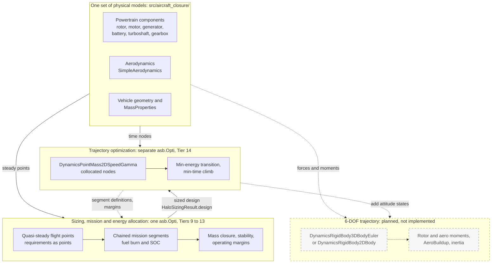

# Architecture diagrams

Four diagrams of how the framework is put together. They summarize
[ARCHITECTURE.md](ARCHITECTURE.md), [MODEL_INTERFACES.md](MODEL_INTERFACES.md),
[OPTIMIZATION_PHILOSOPHY.md](OPTIMIZATION_PHILOSOPHY.md) and
[FIDELITY_ROADMAP.md](FIDELITY_ROADMAP.md); those documents remain the
reference. Tier numbers and statuses follow the roadmap table. In every
diagram, solid boxes and edges are implemented, and dashed boxes and edges are
planned.

## 1. Repository organization and layering

Code lives in `src/aircraft_closure/` (the library) and `examples/` (the
problems that are solved). Dependencies point downward only: a lower layer
never imports a higher one. Every layer builds expressions with AeroSandbox
and CasADi; only the orchestration layer creates `asb.Opti` variables,
constraints and objectives. Tests, per-tier notebooks, plans and CI sit
beside the code and check it.

```mermaid
flowchart TB
    subgraph REPO["Code: dependencies point down only"]
        direction TB
        subgraph L1["1 Orchestration: examples/"]
            sizing["halo_sizing.py<br/>coupled_sizing.py"]
            trajex["trajectory_optimization.py"]
            calib["xv15_reference.py<br/>xv15_performance.py<br/>jvx_rotor_calibration.py"]
        end
        subgraph L2["2 Aircraft assembly: vehicle/"]
            aircraft["Aircraft: wing, tails,<br/>fuselage, items"]
            install["PowertrainInstallation"]
        end
        subgraph L3["3 Disciplines"]
            aero["aerodynamics/"]
            ctrl["controls/"]
            perf["performance/<br/>flight points"]
            mission["mission/"]
            reqs["requirements/"]
            traj["trajectory/"]
        end
        subgraph L4["4 Subsystem assemblies"]
            topo["powertrain/topologies.py<br/>series hybrid"]
            coreports["core/: typed ports,<br/>topology, margins"]
        end
        subgraph L5["5 Components: powertrain/components/"]
            comps["Motor, Generator, Battery,<br/>EquivalentCircuitBattery,<br/>SimpleTurboshaft, Gearbox,<br/>ActuatorDiskPropulsor,<br/>MomentumProfileRotor"]
        end
        subgraph L6["6 Maps, decks, empirical data"]
            afdd["weights/afdd.py"]
            decks["powertrain/decks.py"]
            rotordata["data/rotors/, data/batteries/<br/>JVX tests, 50G cell curves"]
        end
        L1 --> L2 --> L3 --> L4 --> L5 --> L6
    end

    ASB[["AeroSandbox and CasADi<br/>asb.Opti, Atmosphere, MassProperties,<br/>AeroBuildup, dynamics classes"]]
    REPO -- "builds equations with" --> ASB

    subgraph CHECK["Verification and governance"]
        tests["tests/"]
        notebooks["notebooks/tierN_topic/<br/>one executed notebook per tier"]
        plans["docs/ and .agent/plans/<br/>one ExecPlan per tier"]
        ci[".github/workflows/<br/>tests on every push"]
    end
    CHECK -. "verifies" .-> REPO
```

## 2. Fidelity scaling

Callers (flight points, mission segments, trajectory nodes) talk to each
component through the same small interface: `get_mass()`, `get_limits(...)`
and `evaluate(...)`. When fidelity changes but the operating inputs stay the
same, a submodel is swapped inside the component (turboshaft
`part_power_model` and `lapse_exponent`, machine `mass_model`). When the
inputs change, a distinct class is added: `MomentumProfileRotor` needs rotor
speed, so it sits beside `ActuatorDiskPropulsor` rather than replacing it.
The simplest model is always kept, and named legacy assumption sets (for
example `assumptions_tier12b`) reproduce earlier tiers. Calibration data enter
at the bottom; tests and the tier notebook check each step.

```mermaid
flowchart LR
    caller["Callers: flight points,<br/>segments, trajectory nodes"]
    iface["Stable interface<br/>get_mass, get_limits, evaluate"]
    caller -- "same operating inputs" --> iface

    subgraph DATA["Calibration and validation data"]
        jvx["JVX proprotor tests<br/>NASA TM-2016-219070"]
        xv15["XV-15 group weights,<br/>lapse and hover data"]
        gasp["GASP turboshaft deck<br/>user-supplied"]
        cell["Samsung 50G cell data<br/>Paudel et al. 2025"]
    end

    subgraph MODELS["Models: simplest kept, fidelity added behind the interface"]
        direction TB
        subgraph ROTOR["Rotor: distinct classes"]
            direction LR
            r0["ActuatorDiskPropulsor<br/>Tier 1"] -- "new class,<br/>needs rotor speed" --> r1["MomentumProfileRotor<br/>Tier 12"]
            r1 -.-> r2["BEM rotor<br/>if needed"]:::planned
        end
        subgraph TURB["Turboshaft: submodels"]
            direction LR
            t0["Constant efficiency<br/>Tier 1"] --> t1["Density lapse, Geiss,<br/>deck cubic, table<br/>Tiers 10b and 11a"]
            t1 --> t2["Temperature lapse,<br/>ISA + offset<br/>Tier 16"]
        end
        subgraph MACH["Motor and generator: mass_model"]
            direction LR
            m0["Specific power,<br/>McDonald losses<br/>Tier 1"] --> m1["Torque density,<br/>gear ratio<br/>Tier 13"]
        end
        subgraph BATT["Battery"]
            direction LR
            b0["Energy and power<br/>capacity<br/>Tier 1"] -- "new class,<br/>needs current" --> b1["Equivalent circuit,<br/>sag and ageing<br/>Tier 17"]
        end
        subgraph AERO["Aerodynamics"]
            direction LR
            a0["SimpleAerodynamics<br/>Tier 5"] -.-> a1["AeroBuildup primary,<br/>Scholz build-up<br/>Tier 21"]:::planned
        end
        subgraph WTS["Weights"]
            direction LR
            w0["Raymer GA and<br/>AFDD rotorcraft<br/>Tiers 4 and 10a"] -.-> w1["Tiltrotor wing,<br/>whirl flutter<br/>Tier 20"]:::planned
        end
        subgraph NEW["New disciplines, same pattern"]
            direction LR
            e1["Electrical layer<br/>Tier 15"]:::planned
            th1["Thermal<br/>Tier 19"]:::planned
        end
    end

    subgraph VERIFY["Verification"]
        unit["Unit tests: identities,<br/>limits, trends, symbolic"]
        nb["Tier notebook<br/>executed, outputs kept"]
        legacy["Legacy assumption sets<br/>reproduce earlier tiers"]
    end
    iface --> MODELS
    DATA --> MODELS
    MODELS --> VERIFY

    classDef planned fill:#f6f6f6,stroke:#888888,stroke-dasharray:5 5,color:#555555
```

## 3. One model set, three solve levels

The same component and discipline equations feed three kinds of problem.
Sizing, the mission and the energy allocation are solved together in one
`asb.Opti` on quasi-steady flight points (Tiers 9 to 13). Trajectory
optimization is a separate `asb.Opti` on an already-sized aircraft, with
AeroSandbox point-mass dynamics and direct collocation (Tier 14). A 6-DOF
level is not implemented: it is the planned next fidelity step of the
trajectory layer, using AeroSandbox rigid-body dynamics with the same rotor,
aerodynamic and mass models, extended to moments and inertia. The coupling is
one-way: a sized design goes into the trajectory problem, and its results can
be carried back by hand as better segment definitions or margins; sizing
stays on quasi-steady segments.

## 4. The coupled sizing problem

`solve_halo_sizing` in `examples/halo_sizing.py` builds one `asb.Opti`. The
models only return expressions; the example adds every constraint and the
objective, and IPOPT solves everything at once. Operating variables (rotor
speed, battery current, generator torque, electric power fraction) are
created per flight point by `build_flight_point`. The hot-day hover at the
destination (Tier 16) is solved in the same problem.

```mermaid
flowchart LR
    subgraph DV["Design variables"]
        dv1["Take-off mass"]
        dv2["Wing position and area,<br/>tail areas, disk area"]
        dv3["Motor and generator torque,<br/>peak speeds, gear ratio"]
        dv4["Turboshaft rating and mass,<br/>battery power and energy, fuel"]
        dv5["Rotor solidity, tip speed"]
    end

    subgraph MV["Mission and operating variables"]
        mv1["Cruise and loiter speed"]
        mv2["Per point: rotor speed,<br/>battery current, generator<br/>torque, electric fraction"]
    end

    subgraph EQ["Equations from the models"]
        eq1["Aircraft with installed<br/>series-hybrid powertrain"]
        eq2["Mission segments and<br/>requirement flight points"]
        eq3["Mass breakdown and CG"]
    end

    subgraph CON["Constraints"]
        c1["Mass closure"]
        c2["Requirements: hover,<br/>climb, speed, ceiling"]
        c3["Mission: fuel with<br/>reserve, end SOC"]
        c4["Engine-out hover<br/>SOC reserve"]
        c5["Stability: static margin,<br/>Cn_beta, hover trim"]
        c6["Operating margins: speed,<br/>torque, voltage, current"]
        c7["Rotor clearance, stall"]
        c8["Hot-day hover at<br/>destination"]
    end

    obj(["Objective: minimum take-off<br/>mass or maximum payload"])
    solve{{"asb.Opti solve with IPOPT"}}

    DV --> EQ
    MV --> EQ
    EQ --> CON
    CON --> solve
    obj --> solve

    classDef planned fill:#f6f6f6,stroke:#888888,stroke-dasharray:5 5,color:#555555
```

