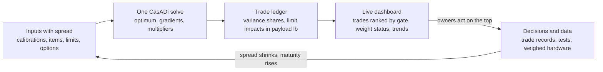

# Halo: from sizing tool to closure system

As of 2026-10-09. Living draft; the editable copy is the
[Claude doc](https://claude.ai/code/artifact/4163863e-363a-449c-8707-b2d8bec244a2).

## Thesis

The sizing tool gives one feasible aircraft: 15,179 lb take-off and 11,130 lb empty weight. To close a real aircraft,
it has to become a system that holds that number from now until the aircraft is weighed. It has to do three things it
does not do today:

1. **Name the big trades before they are forced on us.** Each one gets a decision date, an owner and the model that
   will settle it.
2. **Hold the weight budget.** Every item is booked as installed mass, with its maturity, growth allowance and
   uncertainty, against a not-to-exceed weight.
3. **Watch the interfaces.** Mass grows at the boundaries between subsystems and through the sizing loop, more than in
   any one component.

"Closed" means this: the aircraft meets every mission and failure case at its predicted weight, at a stated
confidence, with the reserve still unspent. A closure at today's basic weight is not enough.

What the tool already gives us: one CasADi problem in which every constraint and sensitivity sits at the optimum,
XV-15 group calibration, an empty-weight prediction with maturity-based growth, and component ports in a topology
graph. The rest of this document builds on those.

## Where the mass hides

The baseline already books the big items: rotors, battery, machines, turbines and the wing. The growth will come from
what installs, connects, cools and protects them, and from what carries their loads. The sizing loop then multiplies
it. Each risk below is already visible in our own model.

| Area | What is missing or soft today | Evidence in the model | Size of the exposure |
| --- | --- | --- | --- |
| HV electrical installation | Inverters, cables, protection and partial-discharge insulation are modelled but **off in the baseline** | Electrical layer converges only by multistart | About 730 lb (330 kg), plus 3 % losses that grow fuel and battery |
| Wing structure at the tilt loads | Jump take-off peak cap strain is 10 % over the ultimate allowable (a negative margin); no buckling step | CalculiX check on v3.3.5; 1 mm unstiffened covers | Stiffened covers and webs, plus whatever share of the 1.33 XV-15 factor is not load-carrying |
| Calibration factors | Fuselage about 2x and flight controls about 4x, from one aircraft | XV-15 statement is the only full one | About ±540 lb take-off weight per ±15 % on a factor |
| Tilt joint and nacelle | HV cables, coolant and data cross a rotating joint; conversion actuator and spindle fittings | Nacelle mass from components; no joint or actuator item | Not yet estimated: an open item, not a zero |
| Thermal | One ram-air exchanger with fans in hover; no loop plumbing, pumps or fluid | Heat exchanger 280 lb (127 kg) sized by the hot-day hover | Plumbing and fluid not booked |
| Failures | Single failures only, applied to both rotors; double failures did not converge | Battery, generators and motors are each sized by a failure case | Asymmetric cases and cross-strapping can resize the drive |
| Coupled growth | Each pound added raises hover power, then battery, machines and structure | The 127 kg exchanger carried knock-on growth in v3.3 | The growth factor at the optimum, still to be published per run |

The rule that follows: **report installed-system mass at the interfaces, with its uncertainty, not supplier component
weights.**

## Weight discipline: how we guarantee the budget

We guarantee the budget by sizing the aircraft to its predicted 99 % weight, not its basic weight, and by holding a
reserve that only the chief engineer can release. Today the baseline carries no margin. At a target equal to today's
basic empty weight, the 99 % value is 1,613 lb over.

### The budget is set top-down, by power

The turbines are fixed at 2 x 1,120 hp, so the critical hover sets a hard ceiling on take-off weight. Below that
ceiling we set a not-to-exceed (NTE) take-off weight. Payload then absorbs growth, so every pound of empty-weight
growth costs a pound of payload, or more once fuel and battery are re-sized.

### The budget stack

| Layer | Today (lb, empty weight) | Who controls it |
| --- | --- | --- |
| Basic weight: the current best estimate, item by item | 11,130 | Item owner |
| + Growth allowance, by maturity (8.6 % today) | 962, giving 12,092 predicted | Weights lead; it shrinks as items mature |
| + Uncertainty margin to 99 % (2.33σ, σ = 280 lb) | About 650, giving 12,743 | Weights lead |
| + Management reserve: unallocated, for what we have not thought of yet | To be set; size it from interface growth (above) | Chief engineer only |
| = NTE empty weight | To be set, at or below the power ceiling minus payload and fuel | Programme |

The σ above is at a fixed take-off weight. Growth through re-sizing, and correlated errors between items, widen it, so
the system has to carry both inside the sizing.

### The rules

1. **Installed mass, or it does not count.** Each item is booked with its mounts, harness, cooling, protection,
   fasteners and access provisions. A supplier dry weight is booked only with an explicit installation allowance.
2. **Every item has an owner, a maturity and a basis.** The maturity categories set the allowance: vendor hardware
   2 %, vendor data 5 %, calculated or layout 8 %, calibrated parametric 10 %, estimated 15 %. A missing item is an
   open item with an estimate, never a zero.
3. **Allocate an NTE to every item.** The owner may trade within it. Going over it needs a weight change request.
4. **Every change is priced at aircraft level.** A change request carries its take-off-weight and payload effect from
   the sizing (component pounds times the growth factor at the optimum), not just its own pounds.
5. **Allowance burns down only with maturity.** An item that moves from "estimated" to "layout" releases allowance,
   but only after the layout weight is in. Released allowance goes back to the reserve, not to the owner.
6. **Traffic lights on the 99 % value.** Green: the 99 % empty weight is under the NTE. Amber: the predicted (mean)
   weight is under but the 99 % is over. Red: the predicted weight is over. Red triggers a recovery plan within one
   reporting cycle.
7. **Report on a fixed rhythm.** A weekly weight status by item and group, the trend against the NTE, and the top ten
   growth items. A full re-close of the aircraft runs at each design freeze.
8. **Weigh real hardware as soon as it exists.** Measured weights replace estimates, and the allowance drops to the
   vendor-hardware rate.

## The trades we can already name

Six trades will set most of Halo's weight, and each must be settled before the hardware it touches is ordered. We
write them down now, with the model that will decide them, so none is made by default. The voltage figures below are
illustrative classes, not proposals. This is the seed list; the trade engine (next sections) adds to it and re-ranks
it.

| Trade | Options | What it drives | Model status today | Decide by |
| --- | --- | --- | --- | --- |
| **HV bus voltage and regulation** | Floating battery bus (today) or a regulated bus behind a DC-DC; voltage class around 400, 800 or 1,000 V | Cable and contactor mass, DC fault interruption, partial-discharge clearances in unpressurized bays at 10,000 ft cruise, and which inverters and machines qualify | Electrical layer modelled but off; bus voltage equals battery voltage; the 2.5 V/cell cutoff in the engine-out hover sizes the battery, so voltage and cell series count are one decision | Before machine and cell selection |
| **Tilting load path** | Spindle chord station (at a spar or between spars); tip rib and fitting concept; conversion actuator position and stiffness | Whirl flutter (the actuator is the pylon pitch spring), root strain in the jump take-off, nacelle CG relative to the elastic axis | Frequency-placement margins only; FE outside the loop shows a negative margin; no spindle, fitting or actuator mass item | Before wing layout freeze |
| **What crosses the tilt joint** | HV: flex loop or slip ring. Coolant: swivel joint, or a separate exchanger in each nacelle. Data: harness or wireless | Nacelle mass, reliability, the thermal architecture | Not modelled | With the tilting load path |
| **Failure architecture** | Interconnect shaft or electrical cross-strapping; lanes, buses and strings (2/2/2 today) | Motors (bus-out hover), generators and battery (engine-out hover) | Single symmetric failures only; double failures did not converge | Before the electrical architecture freeze |
| **Thermal architecture** | One ram-air exchanger with hover fans (today), a liquid loop, or nacelle-local cooling | 280 lb exchanger, cooling drag, hover fan power | Exchanger by mass per watt; no plumbing, pumps or fluid | With the tilt-joint decision |
| **Rotor diameter against span** | Bigger rotors with a longer wing, or today's span-capped radius | Hover power, which sizes the battery, machines and drive | Radius capped by span at the optimum | Before configuration freeze |

### How each trade is run

Each trade gets a one-page trade record, run through the same sizing:

- the question, and the options as discrete cases;
- the criteria, with take-off weight and payload from a re-close of the aircraft, not component pounds;
- the sensitivities that decide it, and how wrong the inputs could be before the answer flips;
- the decision, the owner, the date, and what would reopen it.

## Interface ownership

Every boundary gets one owner, and that owner books the installed mass that crosses it. The topology graph already
connects components through ports that carry voltage and current. Extending the ports to loads, coolant and data makes
each interface a component, with a mass item and a σ of its own.

| Interface | What crosses it | Mass the owner books | Owner (role) |
| --- | --- | --- | --- |
| Battery to HV bus | Voltage, current, fault energy | Feeders, string contactors, fuses, precharge, containment | Electrical architect |
| Turbogenerator to bus | Power, gearbox torque, heat | Generator inverters, step-up gearbox mounts, exhaust and inlet ducting | Propulsion |
| Bus to motor (across the tilt joint) | HV power, coolant, data | Cables, flex loops or slip rings, shielding, partial-discharge insulation | Electrical with nacelle structures |
| Nacelle to wing | Rotor thrust and moments, conversion actuator loads | Spindle, tip rib and fittings, actuator and its backup structure | Structures (tilt load path) |
| Wing to fuselage | Wing bending, nacelle-induced torsion, landing loads | Carry-through, attachment fittings | Structures |
| Heat sources to exchanger | Heat, coolant flow | Pumps, lines, fluid, fans, ducts | Thermal |
| Flight control computers to actuators | Commands, lane redundancy | Harness, ruddervator and conversion actuators | Flight controls |

## The trade engine: the tool finds and ranks the trades

After every solve, the tool should rank every trade left between concept and manufacturing by its effect on weight
and performance. It finds them from two numbers it can already compute: how sensitive the aircraft is to each input,
and how uncertain that input is. The list above is only the seed. The engine adds to it, re-ranks it and retires
trades as they are settled.

### One currency: payload pounds

The turbines fix the take-off weight ceiling, so every effect is expressed as payload gained or lost at the NTE
weight, with take-off weight shown beside it. Performance limits (hover margin, corridor width, speed) are turned into
pounds through the multipliers of their constraints.

### Four detectors, one per kind of trade

1. **Uncertainty drivers: what to learn.** For each uncertain input p with spread σ (calibration factors, drag, rotor
   efficiency, cell data, each item's mass), the impact is |dW/dp| x σ. Its share of the total variance ranks it. The
   gradient is almost free: CasADi returns the parameter multipliers (`lam_p`) at the optimum, and these are the
   derivatives of the optimal take-off weight. A high-ranked driver calls for a test, a calibration or vendor data.
2. **Binding limits: what to argue about.** Each active constraint carries a multiplier: the take-off weight per unit
   of its limit. Multiplied by a plausible change in the limit, this ranks requirement and limit trades. Examples: the
   30 % reserve state of charge, the 2.5 V cell cutoff, the 4,000 ft hover, the span cap on the rotor radius, the 0.28
   edgewise advance ratio.
3. **Open architecture choices: what to decide.** Discrete options are re-closed as cases. A choice stays open while
   the options' 99 % bands overlap. The engine flags it as decided by the data once one option wins at 99 %.
4. **Model gaps: what we have not modelled.** Each unmodelled item (the tilt joint, the conversion actuator, coolant
   plumbing) enters with a prior estimate and a wide σ. It then ranks high on its own until someone models it, so a
   gap can never sit at zero quietly.

### From concept to manufacturing

Each input and trade is tagged with the gate where it locks: concept, preliminary design, detailed design or
manufacturing. The dashboard ranks by impact and sorts by time to lock, so a large trade near its gate rises to the
top. Manufacturing trades come in the same way: a material or process choice, or a tolerance, enters as an item with
its allowance and σ.

### What makes it live

- **A trade ledger written by every solve:** run id, git commit, baseline, every input with its value, σ, source,
  owner and lock gate, plus gradients, multipliers, variance shares, the item table and the open options.
- **A dashboard fed from the ledger:** the ranked trade list, the weight status and traffic lights from the weight
  rules, and the trend of each trade over time. A trade whose impact shrinks as its σ falls is the burn-down.
- **A check that the linear ranking holds:** first-order rankings are local, so the top ten are re-checked by sampled
  re-closes at each design freeze.
- **Decisions write back:** a closed trade record fixes the input, cuts its σ and moves its item's maturity, so the
  next solve re-ranks everything.



The loop closes through the owners: the dashboard points them at the top trades, and their decisions and data cut the
spread for the next solve.

## What is built (plan 041)

The decision ledger is running. It is the chief engineer's war room: every uncertain quantity, binding limit and
open trade, ranked by the take-off weight at stake, with its owner, lock date and planned work.

| Piece | Where | What it does |
| --- | --- | --- |
| Envelope sensitivities | `src/aircraft_closure/core/sensitivity.py` | dJ*/dp for any Opti parameter from one solve, bound terms included; checked against finite differences |
| Priced sizing | `examples/halo_sizing.py` (`SizingSensitivity`) | Every solve returns the growth factor and the take-off price of every margin |
| Ledger model | `src/aircraft_closure/ledger/model.py` | Quantities with evidence and fidelity tiers, burn-down activities, limits, trades |
| Ranking | `src/aircraft_closure/ledger/rank.py` | Four kinds of priority in take-off kg with a range; blind spots never valued at zero; schedule flags |
| Ingest | `src/aircraft_closure/ledger/ingest.py` | A new sizing, analysis, vendor weight or test updates the ledger and snapshots the ranking |
| Halo seed | `examples/halo_ledger.py` | 16 empty-weight items, 6 model gaps, 3 model inputs, 4 architecture trades, every binding limit |
| Ledger file | `ledger/halo.json` | Kept in git: its history is the decision history |
| Dashboard | `ledger/dashboard/index.html` ([live](https://claude.ai/artifact/RdwNbk3GPj2Pwg4FWYojLu)) | Ranked list, risk against schedule, burn-down and log, drawn from `ledger/view.json` |

**Evidence rule.** A re-run of the same source replaces its earlier entry, so re-running a handbook model never
looks like new information. Independent sources at the highest fidelity tier present are fused by inverse variance:
placeholder, handbook, analysis, vendor or component test, weighed hardware.

**Keeping it live.**

```
python -m examples.halo_ledger resize          # after a design change: new sensitivities, limits, masses
python -m aircraft_closure.ledger evidence ledger/halo.json mass.wing 452 25 --source "CalculiX wing box" --fidelity 2
python -m aircraft_closure.ledger rank ledger/halo.json
```

Each command rewrites `ledger/view.json`. Republishing the dashboard with it updates the war room.

## Roadmap

Build the ledger first: every later step reads from it.

1. **Ledger v0.** Declare the uncertain inputs as CasADi parameters with σ, source, owner and lock gate. After each
   solve, write `lam_p`, the constraint multipliers and the item table to a JSON ledger. About 1-2 days.
2. **Ranked list v0.** Compute the variance shares and the active-limit impacts in payload pounds, and render a ranked
   trade table from the ledger. Check the top gradients by finite differences on the baseline. About 1 day.
3. **Size to the 99 % weight.** Carry the growth allowances and σ inside the sizing, and set the NTE and the reserve.
   About 1 day.
4. **Turn on the hidden mass.** The electrical layer on by default, with continuation starts; placeholder items with
   priors for the tilt joint, actuator, plumbing and fittings. About 2 days.
5. **Live dashboard.** The ledger feeds the existing progress dashboard's shared database after each run, with
   history, traffic lights and burn-down. About 1 day.
6. **Discrete options.** Run architecture cases (voltage class, interconnect, thermal concept) automatically, with
   overlap tests at 99 %. About 2 days.
7. **Close the structures loop.** Feed FE gauges and margins back as calibration, so the wing's negative margin
   becomes a sized item. About 2-3 days.

## Open questions

- [ ] What is the NTE take-off weight, and how large is the management reserve?
- [ ] Who sets the σ for each calibration factor and each item: the weights lead or the discipline owners?
- [ ] Which lock gates do we use, and does each have a date?
- [ ] Is payload the right single currency, or do range and hover margin need their own?
- [ ] Does the dashboard update on every run, or only on runs merged to main?
